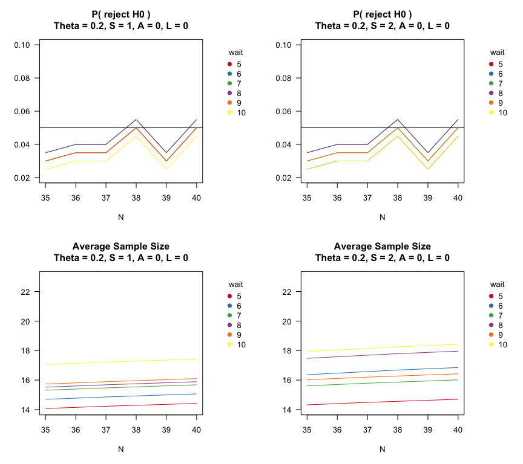
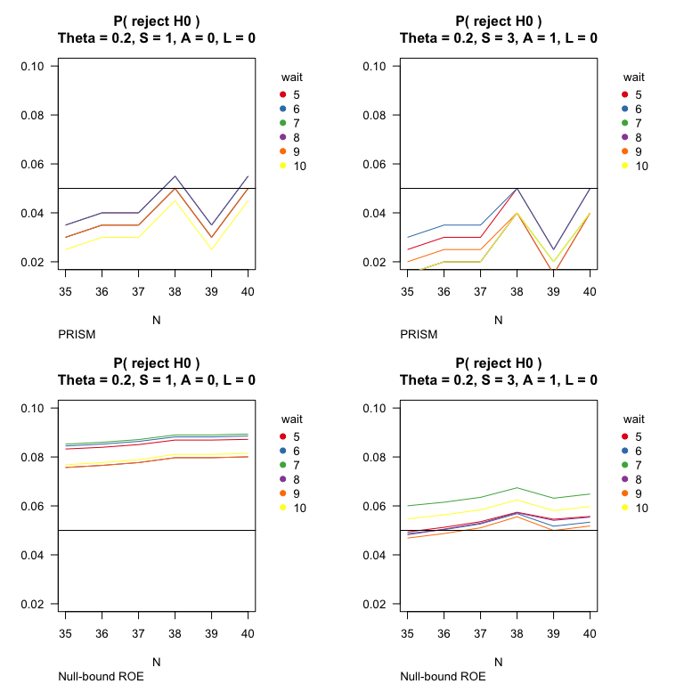
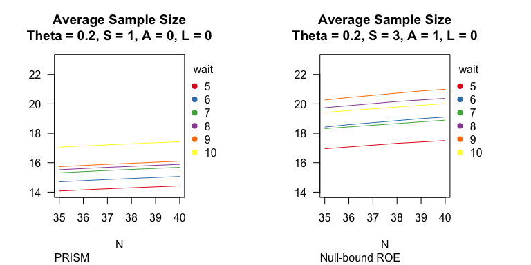
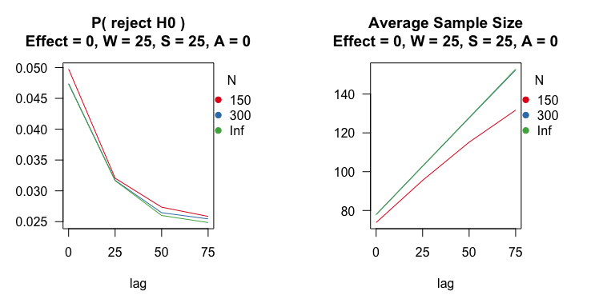
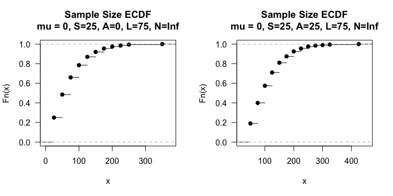
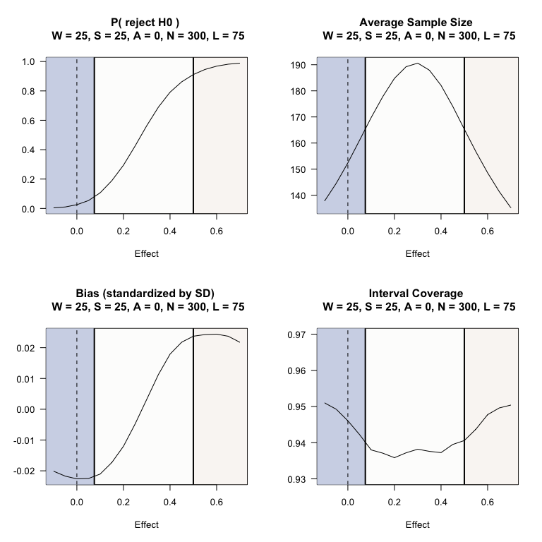
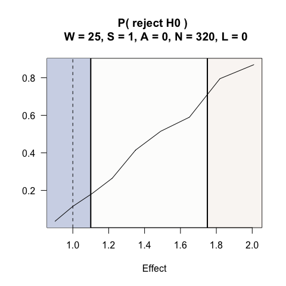

SeqSGPV Package
================
Jonathan Chipman
4/12/2022

## Background

The SeqSGPV package allows the user to obtain study average design
operating characteristics, or a set of simulations, under a variety of
settings for sequential monitoring of evidence using the second
generation p-value (SeqSGPV) on clinically meaningful endpoints.

The SeqSGPV package supports the paper ’’ \[arxiv\] which advances:

1.  SeqSGPV as an evidence-based sequential monitoring strategy. It
    includes existing strategies of repeated credible and confidence
    interval monitoring.
2.  Pre-Specified Regions Indicating Scientific Merit (PRISM) as a set
    of clinically meaningful hypotheses
3.  Monitoring frequency strategies for controlling Type I error rather
    than adjusting evidence level, these include:  
    A. Wait time until monitoring  
    B. Assessment frequency (steps in observations between
    assessments)  
    C. Affirming a stopping rule  
    D. Maximum sample size  

**Why SGPV**: The SGPV is an evidence-based metric that measures the
overlap between an interval and clinically meaningful hypotheses. It may
be used with any inferential interval (ex: bayesian, frequentist,
likelihood, etc.) and therefore has been called ‘method agnostic’.

**Why PRISM**: Previously established clinically meaningful hypotheses
include a Region of Practical Equivalence (ROPE) and Region of
Equivalence (ROE). The ROPE is an indifference zone around the null
hypothesis and monitoring continues until evidence supports the ROPE or
rules out the ROPE. Monitoring a ROPE reduces risks of Type I error of
the point null hypothesis; however, it can lead to indefinite monitoring
for effects on the ROPE boundary. The ROE is a region of indifference
for which the benefit of a treatment is questionable – may be of value
but not quite meaningful enough. The ROE may be monitored with various
strategies. For example, the ROE could mimic ROPE monitoring. It can
also be used to monitoring until ruling out effects below ROE or effects
above ROE (creating overlapping hypotheses).

The PRISM framework brings together concepts of ROPE and ROE monitoring.
PRISM is a ROE of overlapping clinically meaningful hypotheses, yet
further requires the null hypothesis not be on the ROE boundary. The
benefits of PRISM are:

1.  Resolves issue of indefinite monitoring of ROPE  
2.  Compared to null-bound ROE:  
    A. Reduces risk of Type I error for the same monitoring frequency  
    B. Allows for earlier monitoring and yields smaller average sample
    size to achieve the same Type I error  

In a 2-sided study, the PRISM includes a ROPE and Region of Meaningful
effects (ROME). In a 1-sided study, the PRISM includes a Region of Worse
or Practically Equivalent effects (ROWPE) and ROME.

**Why change monitoring frequency**: Controlling the design-based Type I
error is generally considered an important metric for reduces the risk
of false discoveries. A common strategy is to tune the level of evidence
required to draw inference on a hypotheses. Changing the frequency of
looks and/or the quality of looks (such as an affirmation rule) controls
Type I error without compromising evidence level.

**Synergy between 1-sided PRISM and monitoring frequency**: On their
own, both the PRISM and monitoring frequency help reduce the risk of
Type I error. When used together, the 1-sided PRISM and monitoring
frequency can dramatically reduce the average sample size to achieve a
Type I error. When outcomes are delayed, the risk of reversing a
decision on the null hypothesis decreases when monitoring a 1-sided
PRISM more so than under a 1-sided null-bound ROE. Additional
strategies, such as posterior predictive probabilities may be considered
to further inform decisions under delayed outcomes.

**Caveat**: When using confidence intervals, the investigator must
determine how to address issues of bias and coverage which is common to
sequential monitoring. This aspect is beyond the scope of the \[arxiv\]
paper.

## Package overview

Outcomes may be generated from any r\[dist\] distribution, a
user-supplied data generation mechanism, or pre-existing data. Study
designs of bernoulli and continuous outcomes have been more extensively
evaluated and extra care should be provided when designing a study with
other outcomes.

The user provides a function for obtaining interval of interest.
Functions have been built for some common strategies: binomial credible
and confidence intervals using binom::binom.confint, wald confidence
intervals using lm function for continuous outcomes, and wald confidence
intervals using glm function with binomial link for bernoulli outcomes.

Depending on computing environment, simulations may be time consuming to
obtain many (10s of thousands) replicates and more so for bernoulli
outcomes. The user may consider starting with a small number of
replicates (200 - 1000) to get a sense of design operating
characteristics. Sample size estimates of a single look trial may also
inform design parameters.

The examples below highlight designing 1 and 2 sample trials for
bernoulli and continuous outcomes.

## Required install of sgpv package

SeqSGPV requires the sgpv package. To install, call:
devtools::install\_github(“weltybiostat/sgpv”)

# Study design examples

Study designs and interpretations of a single trial are provided below
for 1-2 arm trials with bernoulli or continuous outcomes.

## Example 1a: Phase II, single arm bernoulli outcomes

A prostate cancer trial is design assess the margin status (an immediate
outcome) following a novel surgery technique.

H0: prob success ≤ 0.2  
H1: prob success &gt; 0.2

The investigators says study can afford up to 40 participants and wants
to know the design-based average sample size, Type I error, and Power
across a range of treatment effects. The investigator wishes to use
repeated 95% credible intervals with a Beta(0.005, 0.005) prior on the
success probability.

For this early study, effects deemed essentially equivalent or worse
than the null hypothesis (i.e. ROWPE) are probabilities of success less
than 0.225. The minimal clinically meaningful effect (i.e. ROME
boundary) is 0.4.

As a secondary outcome, the investigator is interested in 3m quality of
live. Before measuring a single patient’s outcome, an additional 5-10
participants may be placed on the trial. This outcome will be assessed
in Example 1b yet simulated here.

The investigator wants a Type I error ≤ 0.05.

``` r
# Example 1
# 1 arm phase II trial with bernoulli outcomes
# H0: prob success = 0.2
# H1: prob success > 0.2
# PRISM: deltaG1 = 0.225, deltaG2 = 0.4
# maximum sample size = 35 - 40
# possible number of lag/delayed outcomes: 0, 5, 10
system.time(PRISM <-  SeqSGPV(nreps            = 20000,
                              dataGeneration   = rbinom, dataGenArgs = list(n=40, size=1, prob = .2),
                              effectGeneration = 0, effectGenArgs=NULL,  effectScale  = "identity",
                              allocation       = 1,
                              effectPN         = 0.2,
                              null             = "less",
                              PRISM            = list(deltaL2 = NA, deltaL1 = NA, 
                                                      deltaG1 = .225, deltaG2 = .4),
                              modelFit         = binomCI,
                              modelFitArgs     = list(conf.level=.95, 
                                                      prior.shape1=0.005, prior.shape2=0.005,
                                                      methods="bayes", type="central"),
                              wait             = 5:10,
                              steps            = 1:3,
                              affirm           = 0:1,
                              lag              = c(0,5,10),
                              N                = 35:40,
                              printProgress    = FALSE))
```

        user   system  elapsed 
    4056.330   41.770  676.359 

Type I error under different monitoring frequencies. Increasing the
number of observations between assessments (steps) and requiring a
stopping rule to be affirmed decreases Type I error.

``` r
par(mfrow=c(2,2))
plot(PRISM,stat = "rejH0", affirm=0, steps=1,lag=0,ylim=c(0.02, 0.10))
abline(h=.05)
plot(PRISM,stat = "rejH0", affirm=0, steps=2,lag=0,ylim=c(0.02, 0.10))
abline(h=.05)
plot(PRISM,stat = "n",     affirm=0, steps=1,lag=0,ylim=c(14,23))
plot(PRISM,stat = "n",     affirm=0, steps=2,lag=0,ylim=c(14,23))
```

<!-- -->

For comparison, consider monitoring the null-bound ROE – determining the
trial successful when there is evidence for an effect &gt; 0.2 and
futile when there is evidence the effect is &lt; 0.4.

``` r
# Change to monitoring null-bound ROE
inputs <- PRISM$inputs
inputs$PRISM$deltaG1 <- 0.20
system.time(PRISM_NullROE <-  do.call(SeqSGPV, inputs))
```

        user   system  elapsed 
    4050.970   44.591  673.154 

``` r
par(mfrow=c(2,2))
# Compare different designs
plot(PRISM,        stat = "rejH0", affirm=0, steps=1,lag=0,ylim=c(0.02, 0.10))
title(sub="PRISM", adj=0)
abline(h=.05)
plot(PRISM,        stat = "rejH0", affirm=1, steps=3,lag=0,ylim=c(0.02, 0.10))
title(sub="PRISM", adj=0)
abline(h=.05)
plot(PRISM_NullROE,stat = "rejH0", affirm=0, steps=1,lag=0,ylim=c(0.02, 0.10))
title(sub="Null-bound ROE", adj=0)
abline(h=.05)
plot(PRISM_NullROE,stat = "rejH0", affirm=1, steps=3,lag=0,ylim=c(0.02, 0.10))
title(sub="Null-bound ROE", adj=0)
abline(h=.05)
```

<!-- -->

Comparing Type I error for the same maximum sample size and nearly
equivalent Type I error.

``` r
summary(PRISM,effect = 0,steps=1,affirm=0,wait=9,N=39,lag=0)
```


    Given: theta = 0.2, W = 9 S = 1, A = 0 and N = 39, with 0 lag (delayed) outcomes
    H0   : theta is less than or equal to 0.2
      Average sample size              = 16.7617
      P( reject H0 )                   = 0.0515
      P( conclude not ROPE effect )    = 0.0496
      P( conclude not ROME effect )    = 0.8748
      P( conclude PRISM inconclusive ) = 0.0756
      Coverage                         = 0.8102
      Bias                             = -0.0354

``` r
summary(PRISM_NullROE,effect = 0,steps=3,affirm=1,wait=6,N=39,lag=0)
```


    Given: theta = 0.2, W = 6 S = 3, A = 1 and N = 39, with 0 lag (delayed) outcomes
    H0   : theta is less than or equal to 0.2
      Average sample size              = 19.1292
      P( reject H0 )                   = 0.0492
      P( conclude not ROPE effect )    = 0.0492
      P( conclude not ROME effect )    = 0.8368
      P( conclude PRISM inconclusive ) = 0.1141
      Coverage                         = 0.6881
      Bias                             = -0.0499

Average sample size between PRISM and null-bound ROE designs.

``` r
par(mfrow=c(1,2))
plot(PRISM,        stat = "n", affirm=0, steps=1,lag=0,ylim=c(14,23))
title(sub="PRISM", adj=0)
plot(PRISM_NullROE,stat = "n", affirm=1, steps=3,lag=0,ylim=c(14,23))
title(sub="Null-bound ROE", adj=0)
```

<!-- -->

Operating characteristics of PRISM design across a range of effects.

``` r
# Obtain design under range of effects
se <- seq(-0.05, 0.3, by = 0.025)
system.time(PRISMse <- fixedDesignEffects(PRISM, shift = se))
```

    [1] "effect: -0.05"
    [1] "effect: -0.025"
    [1] "effect: 0"
    [1] "effect: 0.025"
    [1] "effect: 0.05"
    [1] "effect: 0.075"
    [1] "effect: 0.1"
    [1] "effect: 0.125"
    [1] "effect: 0.15"
    [1] "effect: 0.175"
    [1] "effect: 0.2"
    [1] "effect: 0.225"
    [1] "effect: 0.25"
    [1] "effect: 0.275"
    [1] "effect: 0.3"

         user    system   elapsed 
    56302.561   707.827  9092.803 

``` r
plot(PRISMse, stat = "rejH0", steps = 1, affirm = 0, N = 39, lag=0)
```

<!-- -->

``` r
summary(PRISMse, effect = 0.2, wait = 9, steps = 1, affirm = 0, N = 39, lag = 0)
```


    Given: theta = 0.4, W = 9 S = 1, A = 0 and N = 39, with 0 lag (delayed) outcomes
    H0   : theta is less than or equal to 0.2
      Average sample size              = 18.7221
      P( reject H0 )                   = 0.766
      P( conclude not ROPE effect )    = 0.7418
      P( conclude not ROME effect )    = 0.1427
      P( conclude PRISM inconclusive ) = 0.1154
      Coverage                         = 0.8305
      Bias                             = 0.0358

For comparison with Simon’s 2 stage design,

``` r
clinfun::ph2simon(pu = 0.2, pa = 0.4, ep1 = 0.05, ep2 = 0.2)
```


     Simon 2-stage Phase II design 

    Unacceptable response rate:  0.2 
    Desirable response rate:  0.4 
    Error rates: alpha =  0.05 ; beta =  0.2 

            r1 n1  r  n EN(p0) PET(p0)
    Optimal  3 13 12 43  20.58  0.7473
    Minimax  4 18 10 33  22.25  0.7164

**Example interpretations following SeqSGPV monitoring of PRISM:**

1.  The estimated success probability was 0.39 (95% credible interval:
    0.23, 0.54) which is evidence that the treatment effect is at least
    trivially better than the null hypothesis
    (p<sub>*R**O**W**P**E*</sub> = 0) and is evidence to reject the null
    hypothesis (p<sub>*N**U**L**L*</sub> = 0).

2.  The estimated success probability was 0.13 (95% credible interval:
    0.00, 0.33) which is evidence that the treatment effect is not
    clinically meaningful (p<sub>*R**O**M**E*</sub> = 0). The evidence
    toward the null hypothesis is *p*<sub>*N**U**L**L*</sub> = 0.61.

3.  The estimated success probability was 0.35 (95% credible interval:
    0.203, 0.508), which is suggestive though inconclusive evidence to
    rule out at essentially null effects (p<sub>*R**O**W**P**E*</sub> =
    0.07) yet is evidence to reject the null hypothesis
    (p<sub>*N**U**L**L*</sub> = 0).

4.  The estimated treatment effect was 0.29 (95% confidence interval:
    0.16, 0.45) which is insufficient evidence to rule out any of
    essentially null effects (p<sub>*R**O**W**P**E*</sub> = 0.23),
    clinically meaningful effects (p<sub>*R**O**M**E*</sub> = 0.16), nor
    the null hypothesis effects (p<sub>*N**U**L**L*</sub> = 0.15).

## Example 1b: Phase II trial with delayed outcomes

The same investigator in Example 1 wants to study short term (3m)
quality of life as an endpoint. Increase the number of replicates to
assess the risk of reversal decisions under the null hypotheses with
greater precision.

``` r
par(mfrow=c(2,2))
plot(PRISM,        stat = "lag.rejH0",         affirm=0, steps=1,lag=5,N=38,ylim=c(0.02, 0.10))
abline(h=0.05)
plot(PRISM,        stat = "lag.n",             affirm=0, steps=1,lag=5,N=38,ylim=c(10, 30))
plot(PRISMse,      stat = "lag.rejH0",         affirm=0, steps=1,lag=5,N=38,ylim=c(0, 1))
abline(h=c(0.05, 0.8, 0.9))
plot(PRISMse,      stat = "lag.n",             affirm=0, steps=1,lag=5,N=38,ylim=c(10, 30))
```

## Example 2: Two-arm randomized trial comparing differences in mean of normal outcome

An implementation scientist wishes to compare the impact of using a
fidelity feedback measure to roll out an intervention program. Over
time, the fidelity of the program decreases. The comparison of interest
is mean difference in 12m fidelity between arms. The outcome is assumed
to be normally distributed and a greater mean difference reflects
greater fidelity in the intervention arm.

Participants will be randomized 1:1 to either the standard of care or to
receive the fidelity feedback tool.

H0: mean difference ≤ 0  
H1: mean difference &gt; 0

The investigators says study can afford up to 300 participants, though a
maximum of 150 participants would be ideal, and would like to know the
design-based average sample size, Type I error, and Power across a range
of treatment effects. The investigator prefers to monitor for meaningful
effects using a 95% confidence interval.

In this study, effects deemed essentially equivalent or worse than the
null hypothesis (i.e. ROWPE) are mean differences of -0.075 and greater.
The minimal clinically meaningful effect (i.e. ROME) is an effect size
of at least -0.5.

The investigator wants a Type I error ≤ 0.05.

``` r
# Benchmark power for single-look design
power.t.test(150/2, delta=.5, sig.level = 0.05, alternative = "one.sided")
```


         Two-sample t test power calculation 

                  n = 75
              delta = 0.5
                 sd = 1
          sig.level = 0.05
              power = 0.9196865
        alternative = one.sided

    NOTE: n is number in *each* group

``` r
power.t.test(300/2, delta=.5, sig.level = 0.05, alternative = "one.sided")
```


         Two-sample t test power calculation 

                  n = 150
              delta = 0.5
                 sd = 1
          sig.level = 0.05
              power = 0.9962682
        alternative = one.sided

    NOTE: n is number in *each* group

``` r
# Example 2
# 2 sample trial with continuous outcomes
# H0: mu > 0
# H1: mu < 0
# PRISM: deltaL2 = -0.5, deltaL1 = -0.075
# Assess outcomes monthly -- 25 participants per month
# Possible delayed outcomes -- 0, 25, 50, 75
# Maximum sample size -- 150, 300, Inf


system.time(PRISM2 <-  SeqSGPV(nreps            = 20000,
                               dataGeneration   = rnorm, dataGenArgs = list(n=300,sd=1),
                               effectGeneration = 0, effectGenArgs=NULL,  effectScale  = "identity",
                               allocation       = c(1,1),
                               effectPN         = 0,
                               null             = "less",
                               PRISM            = list(deltaL2 = NA,      deltaL1 = NA, 
                                                       deltaG1 = 0.075,   deltaG2 = 0.5),
                               modelFit         = lmCI,
                               modelFitArgs     = list(miLevel=.95),
                               wait             = 25,
                               steps            = c(1,25),
                               affirm           = c(0, 25),
                               lag              = c(0, 25, 50, 75),
                               N                = c(150, 300, Inf),
                               printProgress    = FALSE))
```

       user  system elapsed 
    678.045  48.464 192.160 

Assess the impact of delayed outcomes.

``` r
par(mfrow=c(1,2))
# Impact of delayed outcomes
plot(PRISM2,stat = "lag.rejH0", affirm=0, steps=25)
plot(PRISM2,stat = "lag.n",     affirm=0, steps=25)
```

<!-- -->

``` r
par(mfrow=c(1,2))
plot(PRISM2$mcmcECDFs$mcmcEndOfStudyEcdfN$W25_S25_A0_L75_NInf,las=1, 
     main = "Sample Size ECDF\nmu = 0, S=25, A=0, L=75, N=Inf")
plot(PRISM2$mcmcECDFs$mcmcEndOfStudyEcdfN$W25_S25_A25_L75_NInf,las=1, 
     main = "Sample Size ECDF\nmu = 0, S=25, A=25, L=75, N=Inf")
```

<!-- -->

Evaluate operating characteristics under a range of plausible outcomes.

``` r
# Obtain design under range of effects
se <- round(seq(-0.1, 0.7, by = 0.05),2)
system.time(PRISMse2 <- fixedDesignEffects(PRISM2, shift = se))
```

    [1] "effect: -0.1"
    [1] "effect: -0.05"
    [1] "effect: 0"
    [1] "effect: 0.05"
    [1] "effect: 0.1"
    [1] "effect: 0.15"
    [1] "effect: 0.2"
    [1] "effect: 0.25"
    [1] "effect: 0.3"
    [1] "effect: 0.35"
    [1] "effect: 0.4"
    [1] "effect: 0.45"
    [1] "effect: 0.5"
    [1] "effect: 0.55"
    [1] "effect: 0.6"
    [1] "effect: 0.65"
    [1] "effect: 0.7"

        user   system  elapsed 
    6562.191 1290.690 1511.386 

``` r
par(mfrow=c(2,2))
plot(PRISMse2, stat = "lag.rejH0", steps = 25, affirm = 0,  N = 300, lag = 75)
plot(PRISMse2, stat = "lag.n",     steps = 25, affirm = 0,  N = 300, lag = 75)
plot(PRISMse2, stat = "lag.bias",  steps = 25, affirm = 0,  N = 300, lag = 75)
plot(PRISMse2, stat = "lag.cover", steps = 25, affirm = 0,  N = 300, lag = 75, ylim=c(0.93, 0.97))
```

<!-- -->

ECDF of sample size for a treatment effect in the Grey Zone.

``` r
plot(PRISMse2$`effect1_0.3`$mcmcECDFs$mcmcEndOfStudyEcdfNLag$W25_S25_A0_L0_N300,las=1, 
     main = "Sample Size ECDF\nmu = 0.3")
```

**Example interpretations following SeqSGPV monitoring of PRISM:**

1.  The estimated treatment effect was 1.05 (95% confidence interval:
    0.24, 1.85) which is evidence that the treatment effect is at least
    trivially better than the null hypothesis
    (p<sub>*R**O**W**P**E*</sub> = 0) and is evidence to reject the null
    hypothesis (p<sub>*N**U**L**L*</sub> = 0).

2.  The estimated treatment effect was -0.61 (95% confidence interval:
    -1.45, 0.24) which is evidence that the treatment effect is not
    clinically meaningful (p<sub>*R**O**M**E*</sub> = 0). The evidence
    toward the null hypothesis is *p*<sub>*N**U**L**L*</sub> = 0.86.

3.  The estimated treatment effect was 0.26 (95% confidence interval:
    0.005, 0.514), which is suggestive though inconclusive evidence to
    rule out at essentially null effects (p<sub>*R**O**W**P**E*</sub> =
    0.14) yet is evidence to reject the null hypothesis
    (p<sub>*N**U**L**L*</sub> = 0).

4.  The estimated treatment effect was 0.30 (95% confidence interval:
    -0.10, 0.69) which is insufficient evidence to rule out any of
    essentially null effects (p<sub>*R**O**W**P**E*</sub> = 0.22),
    clinically meaningful effects (p<sub>*R**O**M**E*</sub> = 0.25), nor
    the null hypothesis effects (p<sub>*N**U**L**L*</sub> = 0.13).

For each conclusion, the following clarification may be provided: Based
on simulations, there may be an absolute bias, in terms of effect size,
as large 0.02 and interval coverage as low as 0.93. The bias is towards
the null for effects less than 0.31 and away from the null for effects
greater than 0.31 (see figure of simulated design-based bias and
coverage).

## Example 3: Two-arm randomized trial comparing odds ratios between groups

An investigator wants to compare the odds ratio between two groups in
which the underlying success probability is 0.35.

H0: odds ratio ≤ 1  
H1: odds ratio &gt; 1

PRISM: *δ*<sub>*G*1</sub> = 1.05 and *δ*<sub>*G*2</sub> = 1.75; ROWPE =
( − ∞, 1.05\], ROME = \[1.75, ∞)

This example uses a small number of replicates to get an initial sense
of operating characteristics

``` r
# Example 3
# 2 sample test, bernoulli outcomes
# H0: OR < 1
# H1: OR > 1
# PRISM: deltaG1 = 1.05, deltaG2 = 1.75
epiR::epi.sscc(OR = 1.75, p1 = NA, p0 = 0.4, n = NA, power = 0.80, r = 1,
               sided.test = 1, conf.level = 0.95, method = "unmatched", fleiss = FALSE)
```

    $n.total
    [1] 320

    $n.case
    [1] 160

    $n.control
    [1] 160

    $power
    [1] 0.8

    $OR
    [1] 1.75

``` r
system.time(PRISM3 <-  SeqSGPV(nreps            = 500,
                               dataGeneration   = rbinom, dataGenArgs = list(n=320, size = 1, prob = 0.35),
                               effectGeneration = 1, effectGenArgs=NULL,  effectScale  = "oddsratio",
                               allocation       = c(1,1),
                               effectPN         = 1,
                               null             = "less",
                               PRISM            = list(deltaL2 = NA,   deltaL1 = NA, 
                                                       deltaG1 = 1.1, deltaG2 = 1.75),
                               modelFit         = lrCI,
                               modelFitArgs     = list(miLevel=.95),
                               wait             = 25,
                               steps            = 1,
                               affirm           = 0,
                               lag              = 0,
                               N                = 320,
                              printProgress    = FALSE))
```

       user  system elapsed 
     87.197   2.729  45.117 
     89.747   2.927  46.606 

``` r
se3 <- round(exp(seq(-0.1, .7, by = .1)),2)
system.time(PRISMse3 <- fixedDesignEffects(PRISM3, shift = se3))
```

    [1] "effect: 0.9"
    [1] "effect: 1"
    [1] "effect: 1.11"
    [1] "effect: 1.22"
    [1] "effect: 1.35"
    [1] "effect: 1.49"
    [1] "effect: 1.65"
    [1] "effect: 1.82"
    [1] "effect: 2.01"

       user  system elapsed 
    687.405  24.638 357.098 
    703.398  25.833 366.224 

``` r
plot(PRISMse3, stat = "rejH0")
```



<!-- -->


## Example 4: Re-visiting example 1 with random effect generation

This example uses a small number of replicates to demonstrate how to
obtain end of study replicates where the effect generation follows a
random distribution. For each replicate, a success probability is drawn
uniformly between 0.1 and 0.5.
random distribution.


``` r
system.time(PRISM1c <-  SeqSGPV(nreps            = 20,
                               dataGeneration   = rbinom, dataGenArgs = list(n=40, size=1, prob = .2),
                               effectGeneration = runif, effectGenArgs=list(n=1, min=-.1, max = .3),  effectScale  = "identity",
                               allocation       = 1,
                               effectPN         = 0.2,
                               null             = "less",
                               PRISM            = list(deltaL2 = NA, deltaL1 = NA, 
                                                       deltaG1 = .225, deltaG2 = .4),
                               modelFit         = binomCI,
                               modelFitArgs     = list(conf.level=.95, 
                                                       prior.shape1=0.005, prior.shape2=0.005,
                                                       methods="bayes", type="central"),
                               wait             = 5:10,
                               steps            = 1:3,
                               affirm           = 0:1,
                               lag              = c(0,5,10),
                               N                = 35:40,
                               printProgress    = FALSE))
```

       user  system elapsed 
<<<<<<< HEAD
      5.509   3.345   1.988 
=======
      4.388   2.487   1.303 
>>>>>>> d6ae415372693bce311fc1fd3997bfbecfa397e8

``` r
head(PRISM1c$mcmcEOS$W5_S1_A0_L0_N35)
```

<<<<<<< HEAD
         theta0     effect0  n         est        bias rejH0 cover stopNotROPE
    [1,]    0.2  0.04109123 24 0.208454810 -0.03263642     0     1           0
    [2,]    0.2  0.04851830 35 0.314338760  0.06582046     0     1           0
    [3,]    0.2  0.17506719 30 0.400033322  0.02496613     1     1           1
    [4,]    0.2  0.23459622  6 0.666389351  0.23179313     1     1           1
    [5,]    0.2 -0.07516344  5 0.000998004 -0.12383856     0     0           0
    [6,]    0.2  0.05957191 17 0.176660788 -0.08291112     0     1           0
         stopNotROME stopInconclusive lag.n     lag.est    lag.bias lag.rejH0
    [1,]           1                0    24 0.208454810 -0.03263642         0
    [2,]           0                1    35 0.314338760  0.06582046         0
    [3,]           0                0    30 0.400033322  0.02496613         1
    [4,]           0                0     6 0.666389351  0.23179313         1
    [5,]           1                0     5 0.000998004 -0.12383856         0
    [6,]           1                0    17 0.176660788 -0.08291112         0
         lag.cover lag.stopNotROPE lag.stopNotROME lag.stopInconclusive
    [1,]         1               0               1                    0
    [2,]         1               0               0                    1
    [3,]         1               1               0                    0
    [4,]         1               1               0                    0
    [5,]         0               0               1                    0
=======
         theta0     effect0  n       est        bias rejH0 cover stopNotROPE
    [1,]    0.2 -0.02161585 30 0.2334222  0.05503804     0     1           0
    [2,]    0.2  0.28658816 18 0.4444753 -0.04211287     1     1           1
    [3,]    0.2 -0.05600805  9 0.1115427 -0.03244922     0     1           0
    [4,]    0.2 -0.01438061 27 0.2223251  0.03670568     0     1           0
    [5,]    0.2  0.01038074 13 0.1541122 -0.05626852     0     1           0
    [6,]    0.2 -0.03740836  9 0.1115427 -0.05104891     0     1           0
         stopNotROME stopInconclusive lag.n   lag.est    lag.bias lag.rejH0
    [1,]           1                0    30 0.2334222  0.05503804         0
    [2,]           0                0    18 0.4444753 -0.04211287         1
    [3,]           1                0     9 0.1115427 -0.03244922         0
    [4,]           1                0    27 0.2223251  0.03670568         0
    [5,]           1                0    13 0.1541122 -0.05626852         0
    [6,]           1                0     9 0.1115427 -0.05104891         0
         lag.cover lag.stopNotROPE lag.stopNotROME lag.stopInconclusive
    [1,]         1               0               1                    0
    [2,]         1               1               0                    0
    [3,]         1               0               1                    0
    [4,]         1               0               1                    0
    [5,]         1               0               1                    0
>>>>>>> d6ae415372693bce311fc1fd3997bfbecfa397e8
    [6,]         1               0               1                    0
         lag.stopInconsistent lag.stopRejH0_YN lag.stopRejH0_NY wait steps affirm
    [1,]                    0                0                0    5     1      0
    [2,]                    0                0                0    5     1      0
    [3,]                    0                0                0    5     1      0
    [4,]                    0                0                0    5     1      0
    [5,]                    0                0                0    5     1      0
    [6,]                    0                0                0    5     1      0
         lag  N
    [1,]   0 35
    [2,]   0 35
    [3,]   0 35
    [4,]   0 35
    [5,]   0 35
    [6,]   0 35
