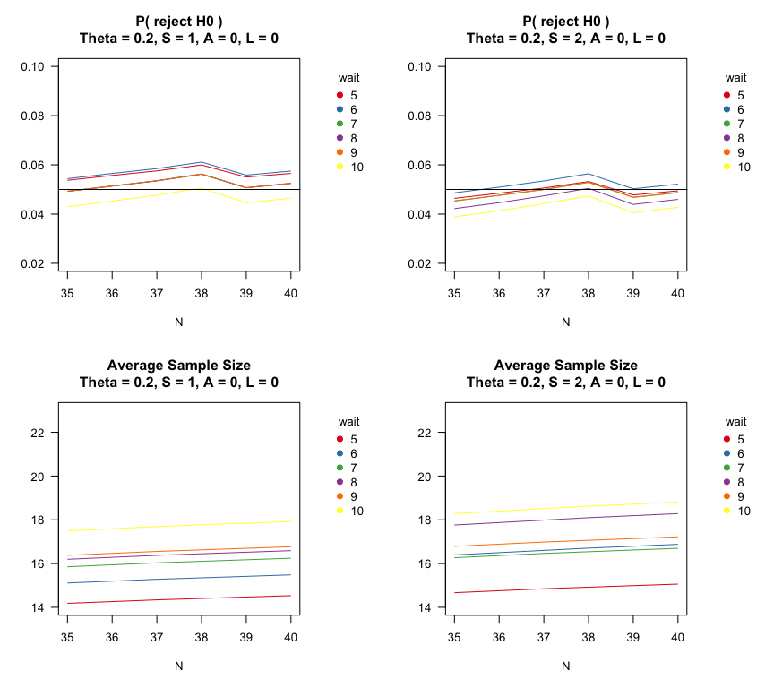
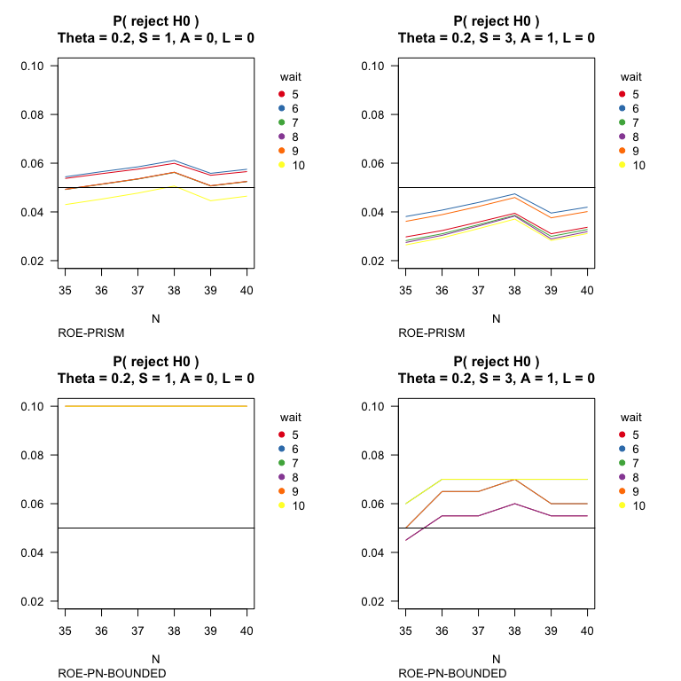
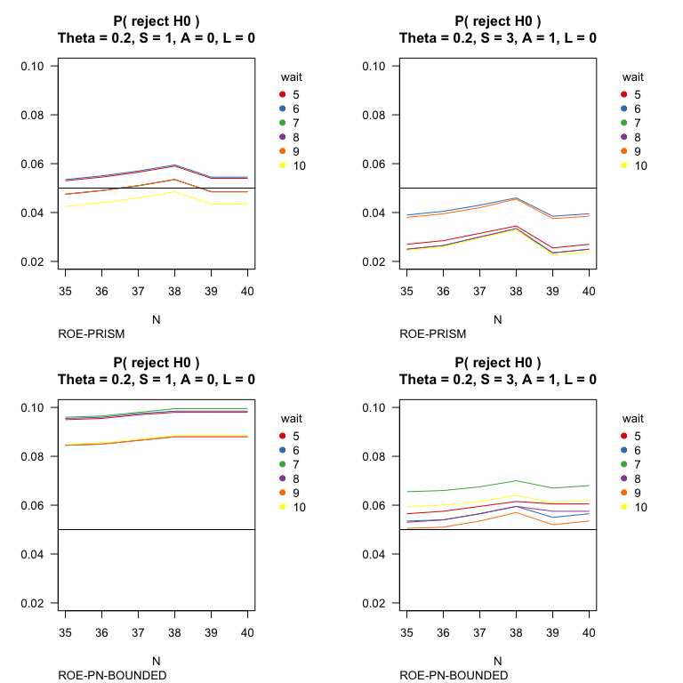
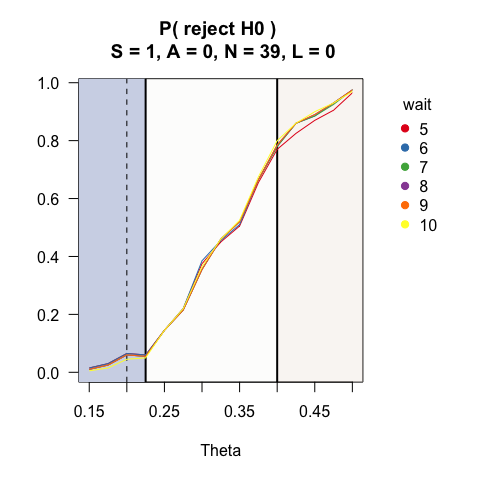
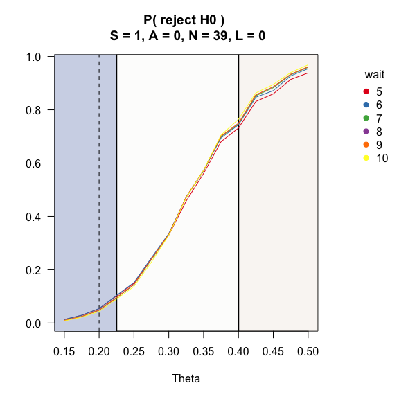

one arm, bernoulli outcomes
================

## Context

A prostate cancer trial is designed to assess an immediate outcome
following a novel surgery technique. Let $\pi$ be the probability of
success. The standard of care has a success rate of $\pi=0.20$. A
minimally scientifically meaningful effect is $\pi = 0.40$.

For this early phase study, the clinician deems success probabilities
less than 0.225 as essentially equivalent or worse than the standard of
care (i.e. ROWPE).

The investigators says the study can afford up to 40 participants and
wants to know the design-based average sample size, Type I error, and
power across a range of treatment effects. The investigator wishes to
use repeated 95% credible intervals with a Beta(0.005, 0.005) prior on
the success probability.

As a secondary outcome, the investigator is interested in 3m quality of
life. Before measuring a single patient’s outcome, an additional 5-10
participants may be placed on the trial. This outcome will be assessed
in [Section: Delayed Outcomes](#Delayed-outcomes) yet simulated in the
initial call to SeqSGPV.

The investigator wants a Type I error $\le$ 0.05 and is willing to
monitor the trial at every outcome.

## Code and design development

``` r
# Example 1
# 1 arm phase II trial with bernoulli outcomes
# H0: prob success <= 0.2
# H1: prob success > 0.2
# PRISM: deltaG1 = 0.225, deltaG2 = 0.4
# Wait time until first evaluation = 5 - 10
# Monitoring every 1 up to 3 outcomes
# maximum sample size = 35 - 40
# possible number of lag/delayed outcomes: 0, 5, 10
nreps <- 50000
system.time(PRISM <-  SeqSGPV(nreps            = nreps,
                              dataGeneration   = rbinom, dataGenArgs = list(n=40, size=1, prob = .2),
                              effectGeneration = 0, effectGenArgs=NULL,  effectScale  = "identity",
                              allocation       = 1,
                              effectPN         = 0.2,
                              null             = "less",
                              PRISM            = list(deltaL2 = NA, deltaL1 = NA, 
                                                      deltaG1 = .225, deltaG2 = .4),
                              modelFit         = binomCI,
                              modelFitArgs     = list(conf.level=.95, 
                                                      prior.shape1=0.005, prior.shape2=0.005,
                                                      methods="bayes", type="central"),
                              wait             = 5:10,
                              steps            = 1:3,
                              affirm           = 0:1,
                              lag              = c(0,5,10),
                              N                = 35:40,
                              printProgress    = FALSE))
```

        user   system  elapsed 
    9342.957  134.172 1575.271 

Type I error under different monitoring frequencies. Increasing the
number of observations between assessments (steps) and requiring a
stopping rule to be affirmed decreases Type I error.

``` r
par(mfrow=c(2,2))
plot(PRISM,stat = "rejH0", affirm=0, steps=1,lag=0,ylim=c(0.02, 0.10))
abline(h=.05)
plot(PRISM,stat = "rejH0", affirm=0, steps=2,lag=0,ylim=c(0.02, 0.10))
abline(h=.05)
plot(PRISM,stat = "n",     affirm=0, steps=1,lag=0,ylim=c(14,23))
plot(PRISM,stat = "n",     affirm=0, steps=2,lag=0,ylim=c(14,23))
```



For comparison, consider SGPV interval monitoring the ROE with a
point-null boundary (ROE-PN-BOUNDED) – determining the trial successful
when there is evidence for an effect \> 0.2 and futile when there is
evidence the effect is \< 0.4.

``` r
# Change to monitoring null-bound ROE
inputs <- PRISM$inputs
inputs$PRISM$deltaG1 <- 0.20
system.time(ROE_PN_BOUNDED <-  do.call(SeqSGPV, inputs))
```

       user  system elapsed 
     12.153   1.129   4.301 

``` r
par(mfrow=c(2,2))
# Compare different designs
plot(PRISM,        stat = "rejH0", affirm=0, steps=1,lag=0,ylim=c(0.02, 0.10))
title(sub="ROE-PRISM", adj=0)
abline(h=.05)
plot(PRISM,        stat = "rejH0", affirm=1, steps=3,lag=0,ylim=c(0.02, 0.10))
title(sub="ROE-PRISM", adj=0)
abline(h=.05)
plot(ROE_PN_BOUNDED,stat = "rejH0", affirm=0, steps=1,lag=0,ylim=c(0.02, 0.10))
title(sub="ROE-PN-BOUNDED", adj=0)
abline(h=.05)
plot(ROE_PN_BOUNDED,stat = "rejH0", affirm=1, steps=3,lag=0,ylim=c(0.02, 0.10))
title(sub="ROE-PN-BOUNDED", adj=0)
abline(h=.05)
```



Comparing Type I error for the same maximum sample size and nearly
equivalent Type I error.

``` r
summary(PRISM,effect = 0,steps=1,affirm=0,wait=9,N=39,lag=0)
```


    Given: theta = 0.2, W = 9 S = 1, A = 0 and N = 39, with 0 lag (delayed) outcomes
    H0   : theta is less than or equal to 0.2
      Average sample size              = 16.6981
      P( reject H0 )                   = 0.0507
      P( conclude not ROPE effect )    = 0.049
      P( conclude not ROME effect )    = 0.8797
      P( conclude PRISM inconclusive ) = 0.0714
      Coverage                         = 0.8141
      Bias                             = -0.0352

``` r
summary(ROE_PN_BOUNDED,effect = 0,steps=3,affirm=1,wait=6,N=39,lag=0)
```


    Given: theta = 0.2, W = 6 S = 3, A = 1 and N = 39, with 0 lag (delayed) outcomes
    H0   : theta is less than or equal to 0.2
      Average sample size              = 19.305
      P( reject H0 )                   = 0.06
      P( conclude not ROPE effect )    = 0.06
      P( conclude not ROME effect )    = 0.815
      P( conclude PRISM inconclusive ) = 0.125
      Coverage                         = 0.695
      Bias                             = -0.0466

Average sample size between PRISM and ROE_PN_BOUNDED designs.

``` r
par(mfrow=c(1,2))
plot(PRISM,        stat = "n", affirm=0, steps=1,lag=0,ylim=c(14,23))
title(sub="ROE-PRISM", adj=0)
plot(ROE_PN_BOUNDED,stat = "n", affirm=1, steps=3,lag=0,ylim=c(14,23))
title(sub="ROE-PN-BOUNDED", adj=0)
```



Operating characteristics of PRISM design across a range of effects.

``` r
# Obtain design under range of effects
se <- seq(-0.05, 0.3, by = 0.125)
system.time(PRISMse <- fixedDesignEffects(PRISM, shift = se))
```

    [1] "effect: -0.05"
    [1] "effect: 0.075"
    [1] "effect: 0.2"

         user    system   elapsed 
    28003.591   385.164  4765.081 

``` r
plot(PRISMse, stat = "rejH0", steps = 1, affirm = 0, N = 39, lag=0)
```



``` r
summary(PRISMse, effect = 0.2, wait = 9, steps = 1, affirm = 0, N = 39, lag = 0)
```


    Given: theta = 0.4, W = 9 S = 1, A = 0 and N = 39, with 0 lag (delayed) outcomes
    H0   : theta is less than or equal to 0.2
      Average sample size              = 18.8114
      P( reject H0 )                   = 0.7699
      P( conclude not ROPE effect )    = 0.745
      P( conclude not ROME effect )    = 0.139
      P( conclude PRISM inconclusive ) = 0.116
      Coverage                         = 0.8363
      Bias                             = 0.0359

As an alternative design, the clinician could consider Simon’s Two Stage
Design.

``` r
clinfun::ph2simon(pu = 0.2, pa = 0.4, ep1 = 0.05, ep2 = 0.2,nmax = 40)
```


     Simon 2-stage Phase II design 

    Unacceptable response rate:  0.2 
    Desirable response rate:  0.4 
    Error rates: alpha =  0.05 ; beta =  0.2 

            r1 n1  r  n EN(p0) PET(p0)   qLo   qHi
    Minimax  4 18 10 33  22.25  0.7164 0.168 1.000
    Optimal  3 14 11 38  21.24  0.6982 0.000 0.168

## Example interpretations following SeqSGPV monitoring of PRISM:

1.  The estimated success probability was 0.54 (95% credible interval:
    0.26, 0.81) which is evidence that the treatment effect is at least
    trivially better than the null hypothesis (p$_{ROWPE}$ = 0) and the
    evidence for being scientifically meaningful (p$_{ROME}$ = 0.74).

2.  The estimated success probability was 0.11 (95% credible interval:
    ~0.00, 0.36) which is evidence that the treatment effect is not
    scientifically meaningful (p$_{ROME}$ = 0) and the evidence for
    being practically equivalent or worse than the point null is
    p\$\_{ROWPE}\$=0.56.

3.  The estimated success probability was 0.35 (95% credible interval:
    0.21, 0.50), which is suggestive though inconclusive evidence to
    rule out at essentially null effects (p$_{ROWPE}$ = 0.04) and
    insufficient to rule out scientifically meaningful effects
    (p\$\_{ROME}\$=0.35).

4.  The estimated treatment effect was 0.28 (95% confidence interval:
    0.15, 0.42) which is insufficient evidence to rule out essentially
    null effects (p$_{ROWPE}$ = 0.37) and scientifically meaningful
    effects (p$_{ROME}$ = 0.07).

## Delayed outcomes

The same investigator in wants to study short term (3m) quality of life
as an endpoint. The below operating characteristics reflect a lag (or
delay) of five outcomes.

``` r
par(mfrow=c(2,2))
plot(PRISM,        stat = "lag.rejH0",         affirm=0, steps=1,lag=5,N=38,ylim=c(0.02, 0.10))
abline(h=0.05)
plot(PRISM,        stat = "lag.n",             affirm=0, steps=1,lag=5,N=38,ylim=c(10, 30))
plot(PRISMse,      stat = "lag.rejH0",         affirm=0, steps=1,lag=5,N=38,ylim=c(0, 1))
abline(h=c(0.05, 0.8, 0.9))
plot(PRISMse,      stat = "lag.n",             affirm=0, steps=1,lag=5,N=38,ylim=c(10, 30))
```


