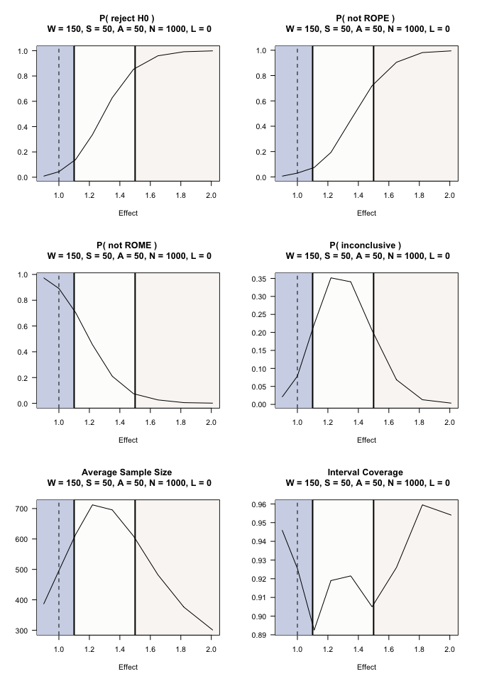

two arm, bernoulli outcomes
================

``` r
Sys.info()[c("sysname","release","version","machine")]
```

                                                                                                     sysname 
                                                                                                    "Darwin" 
                                                                                                     release 
                                                                                                    "22.6.0" 
                                                                                                     version 
    "Darwin Kernel Version 22.6.0: Mon Feb 19 19:48:53 PST 2024; root:xnu-8796.141.3.704.6~1/RELEASE_X86_64" 
                                                                                                     machine 
                                                                                                    "x86_64" 

In this example, 2000 replicates are used to get an initial sense of
operating characteristics. SeqSGPV is more time intensive for bernoulli
outcomes with a sample size as below. It is recommended to start with a
small number of replicates, even under 1000, to get an initial sense of
operating characteristics and then increase for more precision in
estimated operating characteristics.

``` r
library(SeqSGPV)
nreps <- 2000
```

## Context

An investigator wants to compare the odds ratio between two groups in
which the underlying success probability is anticipated to be 0.35. An
increase in the odds by a factor 1.1 or less (i.e., having a probability
of up to 0.37) is considered practically equivalent or worse than 0.35.
And an increase in the odds by a factor of 1.5 (a probability of 0.45)
is considered scientifically meaningful.

Without incorporating scientific relevance, a traditional hypothesis for
the odds ratio, $\theta$ could be:

H0: $\theta$ $\le$ 1  
H1: $\theta$ \> 1

The PRISM is defined by ROE$`_{(1.10, 1.50)}`$.

To benchmark sample size, power calculation for a single-look study may
be calculated as:

``` r
epiR::epi.sscc(OR = 1.5, p1 = NA, p0 = 0.35, n = NA, power = 0.80, r = 1,
               sided.test = 1, conf.level = 0.95, method = "unmatched", fleiss = FALSE)
```

    $n.total
    [1] 632

    $n.case
    [1] 316

    $n.control
    [1] 316

    $power
    [1] 0.8

    $OR
    [1] 1.5

Informed by this sample size calculation, the investigator can afford at
least 650 participants and up to 1000 observations. Outcomes are
assessed within two-weeks, which is short enough to allow all outcomes
to be observed before evaluating stopping rules (though with taking a
2-week enrollment hiatus). The accrual plan is to enroll 50 participants
a month. The study team plans to evaluate outcomes after every 50
observations after observing the first 150 outcomes.

``` r
system.time(PRISM <-  SeqSGPV(nreps            = nreps,
                              dataGeneration   = rbinom, dataGenArgs = list(n=650, size = 1, prob = 0.35),
                              effectGeneration = 1, effectGenArgs=NULL,  effectScale  = "oddsratio",
                              allocation       = c(1,1),
                              effectPN         = 1,
                              null             = "less",
                              PRISM            = list(deltaL2 = NA,   deltaL1 = NA, 
                                                      deltaG1 = 1.1, deltaG2 = 1.5),
                              modelFit         = lrCI,
                              modelFitArgs     = list(miLevel=.95),
                              wait             = 150,
                              steps            = 50,
                              affirm           = c(0,50),
                              lag              = 0,
                              N                = c(650,800,1000),
                              printProgress    = FALSE))
```

        user   system  elapsed 
    1050.659   83.962  318.605 

``` r
# Note: This step is typically done after evaluating operating characteristics
# under the point null. It will be shown again later.
# This step is done here for the sake of saving an Rmd cache with
# minimal retained data (after removing the simulated date).

# Shift effects
# On the log-odds scale, shift from -0.1 to 0.7 and exponentiate back to odds ratio scale
se <- round(exp(seq(-0.1, .7, by = .1)),2)
system.time(PRISMse <- fixedDesignEffects(PRISM, shift = se))
```

    [1] "effect: 0.9"
    [1] "effect: 1"
    [1] "effect: 1.11"
    [1] "effect: 1.22"
    [1] "effect: 1.35"
    [1] "effect: 1.49"
    [1] "effect: 1.65"
    [1] "effect: 1.82"
    [1] "effect: 2.01"

         user    system   elapsed 
    11919.734  1010.723  2904.278 

``` r
# This next step is not required but is done for reducing the size of the Rmd cache.
PRISM$mcmcMonitoring <- NULL
```

``` r
summary(PRISM, N=1000, affirm = 0)
```


    Given: effect = 1, W = 150 S = 50, A = 0 and N = 1000, with 0 lag (delayed) outcomes
    H0   : effect is less than or equal to 1
      Average sample size              = 414.55
      P( reject H0 )                   = 0.054
      P( conclude not ROPE effect )    = 0.046
      P( conclude not ROME effect )    = 0.901
      P( conclude PRISM inconclusive ) = 0.053
      Coverage                         = 0.921
      Bias                             = -0.0629

Under this design and an odds-ratio effect of 1 (i.e. zero effect), the
probability of concluding not ROPE is 0.05 and the probability of
concluding not ROME is 0.90. By the 1000th observation there is a 0.05
probability of not ending not being PRISM conclusive.

``` r
summary(PRISM, N=1000, affirm = 50)
```


    Given: effect = 1, W = 150 S = 50, A = 50 and N = 1000, with 0 lag (delayed) outcomes
    H0   : effect is less than or equal to 1
      Average sample size              = 495.7
      P( reject H0 )                   = 0.0435
      P( conclude not ROPE effect )    = 0.03
      P( conclude not ROME effect )    = 0.8915
      P( conclude PRISM inconclusive ) = 0.0785
      Coverage                         = 0.9255
      Bias                             = -0.0646

Though there is an increase in the average sample size, including the
affirmation step decreases the error rate of not concluding ROPE to
0.03. The probability of not concluding ROME changes from 0.90 to 0.89.
The Type I error rate is controlled to be under 0.05. (Caveat: these
estimates are under limited replicates and more are needed to estimate
error rates with greater precision).

We may suppose that the success rate in the control group is 0.27
(rather than 0.35). Under this assumption, we can evaluate how this
would effect the study’s operating characteristics.

``` r
system.time(PRISMb <-  SeqSGPV(nreps            = nreps,
                               dataGeneration   = rbinom, dataGenArgs = list(n=650, size = 1, prob = 0.27),
                               effectGeneration = 1, effectGenArgs=NULL,  effectScale  = "oddsratio",
                               allocation       = c(1,1),
                               effectPN         = 1,
                               null             = "less",
                               PRISM            = list(deltaL2 = NA,   deltaL1 = NA, 
                                                       deltaG1 = 1.1, deltaG2 = 1.5),
                               modelFit         = lrCI,
                               modelFitArgs     = list(miLevel=.95),
                               wait             = 150,
                               steps            = 50,
                               affirm           = c(0,50),
                               lag              = 0,
                               N                = c(650,800,1000),
                               printProgress    = FALSE,
                               outData          = FALSE))
```

        user   system  elapsed 
    1170.748   95.818  317.882 

``` r
summary(PRISMb, N=1000, affirm = 50)
```


    Given: effect = 1, W = 150 S = 50, A = 50 and N = 1000, with 0 lag (delayed) outcomes
    H0   : effect is less than or equal to 1
      Average sample size              = 530.15
      P( reject H0 )                   = 0.04
      P( conclude not ROPE effect )    = 0.0285
      P( conclude not ROME effect )    = 0.8475
      P( conclude PRISM inconclusive ) = 0.124
      Coverage                         = 0.932
      Bias                             = -0.0643

If the baseline rate were 0.27, it appears that the probability of not
concluding ROPE slightly decreases (0.03) though so too does the
probability of not concluding ROME. The sample size appears to increase.
However, more replicates would be needed to affirm this initial
assessment.

And, we can see what would be the impact if the rate in the control
group were 0.40.

``` r
system.time(PRISMc <-  SeqSGPV(nreps            = nreps,
                               dataGeneration   = rbinom, dataGenArgs = list(n=650, size = 1, prob = 0.40),
                               effectGeneration = 1, effectGenArgs=NULL,  effectScale  = "oddsratio",
                               allocation       = c(1,1),
                               effectPN         = 1,
                               null             = "less",
                               PRISM            = list(deltaL2 = NA,   deltaL1 = NA, 
                                                       deltaG1 = 1.1, deltaG2 = 1.5),
                               modelFit         = lrCI,
                               modelFitArgs     = list(miLevel=.95),
                               wait             = 150,
                               steps            = 50,
                               affirm           = c(0,50),
                               lag              = 0,
                               N                = c(650,800,1000),
                               printProgress    = FALSE,
                               outData          = FALSE))
```

       user  system elapsed 
    876.089  62.363 271.592 

``` r
summary(PRISMc, N=1000, affirm = 50)
```


    Given: effect = 1, W = 150 S = 50, A = 50 and N = 1000, with 0 lag (delayed) outcomes
    H0   : effect is less than or equal to 1
      Average sample size              = 477.375
      P( reject H0 )                   = 0.0405
      P( conclude not ROPE effect )    = 0.027
      P( conclude not ROME effect )    = 0.91
      P( conclude PRISM inconclusive ) = 0.063
      Coverage                         = 0.9275
      Bias                             = -0.0662

With too few replicates to be conclusive, this change in the baseline
rate in the control group appears to have minimal impact upon operating
characteristics, though with a decrease in average sample size.

The next step would be to increase the number of replicates for greater
precision of operating characteristics. In this example, we will suppose
the operating characteristics meet satisfaction.

Having established Type I error control, we can further evaluate
operating characteristics under a range of plausible outcomes.

This next step was run previously but is shown here again as it is when
the step would more naturally take place.

``` r
# Shift effects
# On the log-odds scale, shift from -0.1 to 0.7 and exponentiate back to odds ratio scale
se <- round(exp(seq(-0.1, .7, by = .1)),2)
system.time(PRISMse <- fixedDesignEffects(PRISM, shift = se))
```

``` r
par(mfrow=c(3,2))
plot(PRISMse, stat = "rejH0",            N = 1000, affirm = 50)
plot(PRISMse, stat = "stopNotROPE",      N = 1000, affirm = 50)
plot(PRISMse, stat = "stopNotROME",      N = 1000, affirm = 50)
plot(PRISMse, stat = "stopInconclusive", N = 1000, affirm = 50)
plot(PRISMse, stat = "n",                N = 1000, affirm = 50)
plot(PRISMse, stat = "cover",            N = 1000, affirm = 50)
```



## Example interpretations following SeqSGPV monitoring of PRISM:

1.  The estimated odds ratio was 2.47 (95% confidence interval: 1.11,
    5.46) which is evidence that the treatment effect is at least
    trivially better than the null hypothesis (p$`_{ROWPE}`$ = 0) and
    the evidence for being scientifically meaningful (p$`_{ROME}`$ =
    0.91).

2.  The estimated odds ratio was 0.88 (95% confidence interval: 0.52,
    1.49) which is evidence that the treatment effect is not
    scientifically meaningful (p$`_{ROME}`$ = 0) and the evidence for
    being practically equivalent or worse than the point null is
    p$`_{ROWPE}`$=0.60.

3.  The estimated odds ratio was 1.14 (95% credible interval: 0.83,
    1.57) at the maximum sample size, which is inconclusive evidence to
    rule out practically null effects (p$`_{ROWPE}`$ = 0.36) and
    scientifically meaningful effects (p$`_{ROME}`$=0.09). There is more
    evidence that the effect is scientifically meaningful rather than
    practically null.

For each conclusion, the following clarification may be provided[^1]:
Based on simulations with $W=150, S=50, A=50, N=1000$, the coverage may
be as low as 0.89. Please refer to the figure of simulated design-based
bias and coverage.

[^1]: More replicates would be needed for this clarification sentence.
