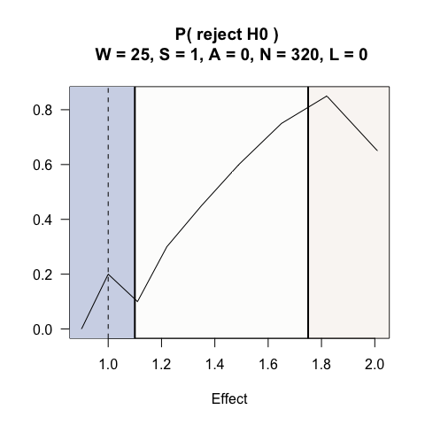

Phase II, single arm bernoulli outcomes
================

## Example 3: Two-arm randomized trial comparing odds ratios between groups

An investigator wants to compare the odds ratio between two groups in
which the underlying success probability is 0.35.

H0: odds ratio $\le$ 1  
H1: odds ratio \> 1

PRISM: $\delta_{G1}=1.05$ and $\delta_{G2}=1.75$; ROWPE =
($-\infty, 1.05$\], ROME = \[$1.75, \infty$)

``` r
# Example 3
# 2 sample test, bernoulli outcomes
# H0: OR < 1
# H1: OR > 1
# PRISM: deltaG1 = 1.05, deltaG2 = 1.75
epiR::epi.sscc(OR = 1.75, p1 = NA, p0 = 0.4, n = NA, power = 0.80, r = 1,
               sided.test = 1, conf.level = 0.95, method = "unmatched", fleiss = FALSE)
```

    $n.total
    [1] 320

    $n.case
    [1] 160

    $n.control
    [1] 160

    $power
    [1] 0.8

    $OR
    [1] 1.75

``` r
system.time(PRISM3 <-  SeqSGPV(nreps            = nreps,
                               dataGeneration   = rbinom, dataGenArgs = list(n=320, size = 1, prob = 0.35),
                               effectGeneration = 1, effectGenArgs=NULL,  effectScale  = "oddsratio",
                               allocation       = c(1,1),
                               effectPN         = 1,
                               null             = "less",
                               PRISM            = list(deltaL2 = NA,   deltaL1 = NA, 
                                                       deltaG1 = 1.1, deltaG2 = 1.75),
                               modelFit         = lrCI,
                               modelFitArgs     = list(miLevel=.95),
                               wait             = 25,
                               steps            = 1,
                               affirm           = 0,
                               lag              = 0,
                               N                = 320,
                              printProgress    = FALSE))
```

       user  system elapsed 
      0.917   0.223   0.604 

``` r
se3 <- round(exp(seq(-0.1, .7, by = .1)),2)
system.time(PRISMse3 <- fixedDesignEffects(PRISM3, shift = se3))
```

    [1] "effect: 0.9"
    [1] "effect: 1"
    [1] "effect: 1.11"
    [1] "effect: 1.22"
    [1] "effect: 1.35"
    [1] "effect: 1.49"
    [1] "effect: 1.65"
    [1] "effect: 1.82"
    [1] "effect: 2.01"

       user  system elapsed 
      7.070   1.424   4.279 

``` r
plot(PRISMse3, stat = "rejH0")
```


