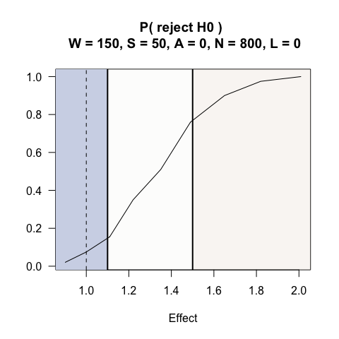
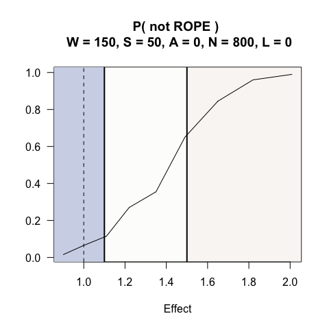
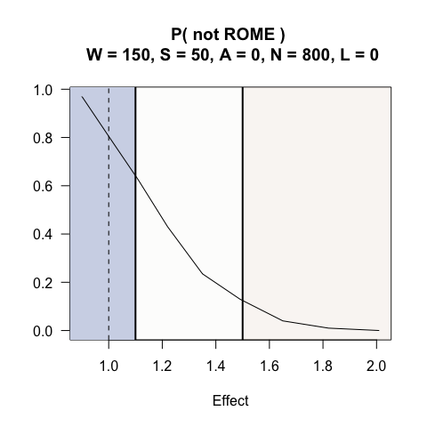
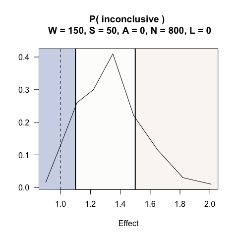

one arm, bernoulli outcomes
================

## Context

An investigator wants to compare the odds ratio between two groups in
which the underlying success probability is anticipated to be 0.35. An
increase in the odds by a factor 1.1 or less (i.e., having a probability
of up to 0.37) is considered practically equivalent or worse than 0.35.
And an increase in the odds by a factor of 1.5 (a probability of 0.45)
is considered scientifically meaningful.

Without incorporating scientific relevance, a traditional hypothesis for
the odds ratio, $\theta$ could be:

H0: $\theta$ $\le$ 1  
H1: $\theta$ \> 1

The PRISM is defined by ROE$_{(1.10, 1.50)}$.

Power calculation for a single-look study

``` r
# H0: OR < 1
# H1: OR > 1
# PRISM: deltaG1 = 1.05, deltaG2 = 1.75
epiR::epi.sscc(OR = 1.5, p1 = NA, p0 = 0.35, n = NA, power = 0.80, r = 1,
               sided.test = 1, conf.level = 0.95, method = "unmatched", fleiss = FALSE)
```

    $n.total
    [1] 632

    $n.case
    [1] 316

    $n.control
    [1] 316

    $power
    [1] 0.8

    $OR
    [1] 1.5

Based on this sample size calculation, the investigator can afford 650
participants and has potential to enroll up to 800 participants.
Outcomes are assessed within two-weeks, which is short enough to allow
all outcomes to be observed before evaluating stopping rules. The
accrual plan is to enroll 50 participants a month. The study team plans
to evaluate outcomes after every 50 observations after observing the
first 150 outcomes.

``` r
system.time(PRISM <-  SeqSGPV(nreps            = nreps,
                              dataGeneration   = rbinom, dataGenArgs = list(n=650, size = 1, prob = 0.35),
                              effectGeneration = 1, effectGenArgs=NULL,  effectScale  = "oddsratio",
                              allocation       = c(1,1),
                              effectPN         = 1,
                              null             = "less",
                              PRISM            = list(deltaL2 = NA,   deltaL1 = NA, 
                                                      deltaG1 = 1.1, deltaG2 = 1.5),
                              modelFit         = lrCI,
                              modelFitArgs     = list(miLevel=.95),
                              wait             = 150,
                              steps            = 50,
                              affirm           = c(0,50),
                              lag              = 0,
                              N                = c(650,800,1000),
                              printProgress    = FALSE))
```

       user  system elapsed 
    119.389  24.501  39.980 

``` r
summary(PRISM, N=800, affirm = 0)
```


    Given: effect = 1, W = 150 S = 50, A = 0 and N = 800, with 0 lag (delayed) outcomes
    H0   : effect is less than or equal to 1
      Average sample size              = 398
      P( reject H0 )                   = 0.075
      P( conclude not ROPE effect )    = 0.065
      P( conclude not ROME effect )    = 0.805
      P( conclude PRISM inconclusive ) = 0.13
      Coverage                         = 0.905
      Bias                             = -0.0394

Under this design and an odds-ratio effect of 1 (i.e. zero effect), the
probability of concluding not ROPE is XXX and the probability of
concluding not ROME is XXX. By the 1000th observation there is a XX
probability of not ending not being PRISM conclusive.

We may suppose that the success rate in the control group is 0.27
(rather than 0.35). Under this assumption, we can evaluate how this
would effect the study’s operating characteristics.

``` r
system.time(PRISMb <-  SeqSGPV(nreps            = nreps,
                               dataGeneration   = rbinom, dataGenArgs = list(n=650, size = 1, prob = 0.27),
                               effectGeneration = 1, effectGenArgs=NULL,  effectScale  = "oddsratio",
                               allocation       = c(1,1),
                               effectPN         = 1,
                               null             = "less",
                               PRISM            = list(deltaL2 = NA,   deltaL1 = NA, 
                                                       deltaG1 = 1.1, deltaG2 = 1.5),
                               modelFit         = lrCI,
                               modelFitArgs     = list(miLevel=.95),
                               wait             = 150,
                               steps            = 50,
                               affirm           = c(0,50),
                               lag              = 0,
                               N                = c(650,800,1000),
                               printProgress    = FALSE))
```

       user  system elapsed 
    119.055  16.390  34.687 

``` r
summary(PRISMb, N=800, affirm = 0)
```


    Given: effect = 1, W = 150 S = 50, A = 0 and N = 800, with 0 lag (delayed) outcomes
    H0   : effect is less than or equal to 1
      Average sample size              = 443.5
      P( reject H0 )                   = 0.03
      P( conclude not ROPE effect )    = 0.03
      P( conclude not ROME effect )    = 0.785
      P( conclude PRISM inconclusive ) = 0.185
      Coverage                         = 0.94
      Bias                             = -0.0623

And we can see what would be the impact if the rate in the control group
were 0.40.

``` r
system.time(PRISMc <-  SeqSGPV(nreps            = nreps,
                               dataGeneration   = rbinom, dataGenArgs = list(n=650, size = 1, prob = 0.40),
                               effectGeneration = 1, effectGenArgs=NULL,  effectScale  = "oddsratio",
                               allocation       = c(1,1),
                               effectPN         = 1,
                               null             = "less",
                               PRISM            = list(deltaL2 = NA,   deltaL1 = NA, 
                                                       deltaG1 = 1.1, deltaG2 = 1.5),
                               modelFit         = lrCI,
                               modelFitArgs     = list(miLevel=.95),
                               wait             = 150,
                               steps            = 50,
                               affirm           = c(0,50),
                               lag              = 0,
                               N                = c(650,800,1000),
                               printProgress    = FALSE))
```

       user  system elapsed 
     85.127  11.821  29.638 

``` r
summary(PRISMc, N=800, affirm = 0)
```


    Given: effect = 1, W = 150 S = 50, A = 0 and N = 800, with 0 lag (delayed) outcomes
    H0   : effect is less than or equal to 1
      Average sample size              = 378
      P( reject H0 )                   = 0.045
      P( conclude not ROPE effect )    = 0.03
      P( conclude not ROME effect )    = 0.87
      P( conclude PRISM inconclusive ) = 0.1
      Coverage                         = 0.93
      Bias                             = -0.0676

``` r
# Shift effects
# On the log-odds scale, shift from -0.1 to 0.7 and exponentiate back to odds ratio scale
se <- round(exp(seq(-0.1, .7, by = .1)),2)
system.time(PRISMse <- fixedDesignEffects(PRISM, shift = se))
```

    [1] "effect: 0.9"
    [1] "effect: 1"
    [1] "effect: 1.11"
    [1] "effect: 1.22"
    [1] "effect: 1.35"
    [1] "effect: 1.49"
    [1] "effect: 1.65"
    [1] "effect: 1.82"
    [1] "effect: 2.01"

        user   system  elapsed 
    1174.798  143.937  306.064 

``` r
plot(PRISMse, stat = "rejH0", N = 800, affirm = 0)
```



``` r
plot(PRISMse, stat = "stopNotROPE", N = 800, affirm = 0)
```



``` r
plot(PRISMse, stat = "stopNotROME", N = 800, affirm = 0)
```



``` r
plot(PRISMse, stat = "stopInconclusive", N = 800, affirm = 0)
```



``` r
plot(PRISMse, stat = "cover", N = 800, affirm = 0)
```


## Example interpretations following SeqSGPV monitoring of PRISM:

1.  The estimated odds ratio was 2.47 (95% confidence interval: 1.11,
    5.46) which is evidence that the treatment effect is at least
    trivially better than the null hypothesis (p$_{ROWPE}$ = 0) and the
    evidence for being scientifically meaningful (p$_{ROME}$ = 0.91).

2.  The estimated odds ratio was 0.88 (95% confidence interval: 0.52,
    1.49) which is evidence that the treatment effect is not
    scientifically meaningful (p$_{ROME}$ = 0) and the evidence for
    being practically equivalent or worse than the point null is
    p\$\_{ROWPE}\$=0.60.

3.  The estimated odds ratio was 1.14 (95% credible interval: 0.83,
    1.57) at the maximum sample size, which is inconclusive evidence to
    rule out practically null effects (p$_{ROWPE}$ = 0.36) and
    scientifically meaningful effects (p\$\_{ROME}\$=0.09). There is
    more evidence that the effect is scientifically meaningful rather
    than practically null.
