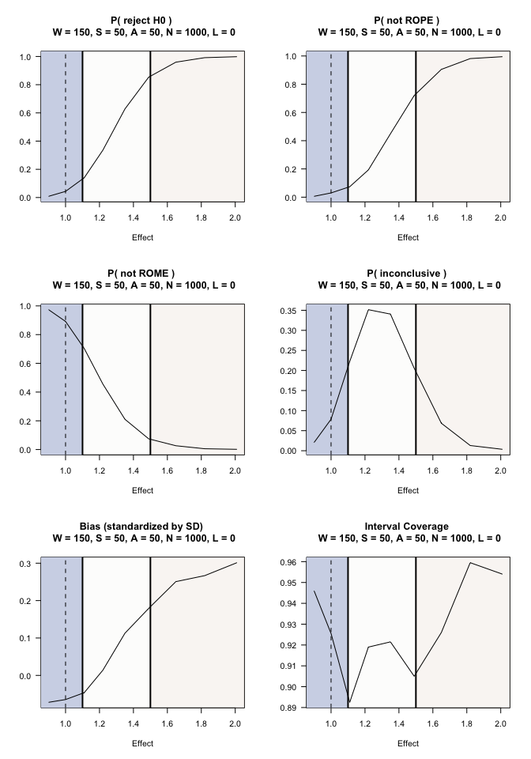

two arm, bernoulli outcomes
================

``` r
Sys.info()[c("sysname","release","version","machine")]
```

                                                                                                     sysname 
                                                                                                    "Darwin" 
                                                                                                     release 
                                                                                                    "22.6.0" 
                                                                                                     version 
    "Darwin Kernel Version 22.6.0: Mon Feb 19 19:48:53 PST 2024; root:xnu-8796.141.3.704.6~1/RELEASE_X86_64" 
                                                                                                     machine 
                                                                                                    "x86_64" 

In this example, 2000 replicates are used to get an initial sense of
operating characteristics. SeqSGPV is more time intensive for bernoulli
outcomes with a sample size as below. It is recommended to start with a
small number of replicates, even under 1000, to get an initial sense of
operating characteristics and then increase for more precision in
estimated operating characteristics.

``` r
library(SeqSGPV)
nreps <- 2000
```

## Context

An investigator wants to compare the odds ratio between two groups in
which the underlying success probability is anticipated to be 0.35. An
increase in the odds by a factor 1.1 or less (i.e., having a probability
of up to 0.37) is considered practically equivalent or worse than 0.35.
And an increase in the odds by a factor of 1.5 (a probability of 0.45)
is considered scientifically meaningful.

Without incorporating scientific relevance, a traditional hypothesis for
the odds ratio, $\theta$ could be:

H0: $\theta$ $\le$ 1  
H1: $\theta$ \> 1

The PRISM is defined by ROE$`_{(1.10, 1.50)}`$.

Power calculation for a single-look study

``` r
epiR::epi.sscc(OR = 1.5, p1 = NA, p0 = 0.35, n = NA, power = 0.80, r = 1,
               sided.test = 1, conf.level = 0.95, method = "unmatched", fleiss = FALSE)
```

    $n.total
    [1] 632

    $n.case
    [1] 316

    $n.control
    [1] 316

    $power
    [1] 0.8

    $OR
    [1] 1.5

Based on this sample size calculation, the investigator can afford 650
participants and has potential to enroll up to 800 participants.
Outcomes are assessed within two-weeks, which is short enough to allow
all outcomes to be observed before evaluating stopping rules. The
accrual plan is to enroll 50 participants a month. The study team plans
to evaluate outcomes after every 50 observations after observing the
first 150 outcomes.

``` r
system.time(PRISM <-  SeqSGPV(nreps            = nreps,
                              dataGeneration   = rbinom, dataGenArgs = list(n=650, size = 1, prob = 0.35),
                              effectGeneration = 1, effectGenArgs=NULL,  effectScale  = "oddsratio",
                              allocation       = c(1,1),
                              effectPN         = 1,
                              null             = "less",
                              PRISM            = list(deltaL2 = NA,   deltaL1 = NA, 
                                                      deltaG1 = 1.1, deltaG2 = 1.5),
                              modelFit         = lrCI,
                              modelFitArgs     = list(miLevel=.95),
                              wait             = 150,
                              steps            = 50,
                              affirm           = c(0,50),
                              lag              = 0,
                              N                = c(650,800,1000),
                              printProgress    = FALSE))
```

        user   system  elapsed 
    1050.659   83.962  318.605 

``` r
# Note: This step is typically done after evaluating operating characteristics
# under the point null. It will be shown again later.
# This step is done here for the sake of saving an Rmd cache with
# minimal retained data (after removing the simulated date).

# Shift effects
# On the log-odds scale, shift from -0.1 to 0.7 and exponentiate back to odds ratio scale
se <- round(exp(seq(-0.1, .7, by = .1)),2)
system.time(PRISMse <- fixedDesignEffects(PRISM, shift = se))
```

    [1] "effect: 0.9"
    [1] "effect: 1"
    [1] "effect: 1.11"
    [1] "effect: 1.22"
    [1] "effect: 1.35"
    [1] "effect: 1.49"
    [1] "effect: 1.65"
    [1] "effect: 1.82"
    [1] "effect: 2.01"

         user    system   elapsed 
    11919.734  1010.723  2904.278 

``` r
# This next step is not required but is done for reducing the size of the Rmd cache.
PRISM$mcmcMonitoring <- NULL
```

``` r
summary(PRISM, N=800, affirm = 0)
```


    Given: effect = 1, W = 150 S = 50, A = 0 and N = 800, with 0 lag (delayed) outcomes
    H0   : effect is less than or equal to 1
      Average sample size              = 397.35
      P( reject H0 )                   = 0.055
      P( conclude not ROPE effect )    = 0.0435
      P( conclude not ROME effect )    = 0.8455
      P( conclude PRISM inconclusive ) = 0.111
      Coverage                         = 0.92
      Bias                             = -0.0584

Under this design and an odds-ratio effect of 1 (i.e. zero effect), the
probability of concluding not ROPE is 0.03 and the probability of
concluding not ROME is 0.85. By the 2000th observation there is a 0.12
probability of not ending not being PRISM conclusive.

We may suppose that the success rate in the control group is 0.27
(rather than 0.35). Under this assumption, we can evaluate how this
would effect the study’s operating characteristics.

``` r
system.time(PRISMb <-  SeqSGPV(nreps            = nreps,
                               dataGeneration   = rbinom, dataGenArgs = list(n=650, size = 1, prob = 0.27),
                               effectGeneration = 1, effectGenArgs=NULL,  effectScale  = "oddsratio",
                               allocation       = c(1,1),
                               effectPN         = 1,
                               null             = "less",
                               PRISM            = list(deltaL2 = NA,   deltaL1 = NA, 
                                                       deltaG1 = 1.1, deltaG2 = 1.5),
                               modelFit         = lrCI,
                               modelFitArgs     = list(miLevel=.95),
                               wait             = 150,
                               steps            = 50,
                               affirm           = c(0,50),
                               lag              = 0,
                               N                = c(650,800,1000),
                               printProgress    = FALSE,
                               outData          = FALSE))
```

        user   system  elapsed 
    1217.799   99.822  340.065 

``` r
summary(PRISMb, N=800, affirm = 0)
```


    Given: effect = 1, W = 150 S = 50, A = 0 and N = 800, with 0 lag (delayed) outcomes
    H0   : effect is less than or equal to 1
      Average sample size              = 421.45
      P( reject H0 )                   = 0.043
      P( conclude not ROPE effect )    = 0.0315
      P( conclude not ROME effect )    = 0.823
      P( conclude PRISM inconclusive ) = 0.1455
      Coverage                         = 0.9305
      Bias                             = -0.076

And we can see what would be the impact if the rate in the control group
were 0.40.

``` r
system.time(PRISMc <-  SeqSGPV(nreps            = nreps,
                               dataGeneration   = rbinom, dataGenArgs = list(n=650, size = 1, prob = 0.40),
                               effectGeneration = 1, effectGenArgs=NULL,  effectScale  = "oddsratio",
                               allocation       = c(1,1),
                               effectPN         = 1,
                               null             = "less",
                               PRISM            = list(deltaL2 = NA,   deltaL1 = NA, 
                                                       deltaG1 = 1.1, deltaG2 = 1.5),
                               modelFit         = lrCI,
                               modelFitArgs     = list(miLevel=.95),
                               wait             = 150,
                               steps            = 50,
                               affirm           = c(0,50),
                               lag              = 0,
                               N                = c(650,800,1000),
                               printProgress    = FALSE,
                               outData          = FALSE))
```

       user  system elapsed 
    865.080  58.988 274.483 

``` r
summary(PRISMc, N=800, affirm = 0)
```


    Given: effect = 1, W = 150 S = 50, A = 0 and N = 800, with 0 lag (delayed) outcomes
    H0   : effect is less than or equal to 1
      Average sample size              = 381.175
      P( reject H0 )                   = 0.0485
      P( conclude not ROPE effect )    = 0.038
      P( conclude not ROME effect )    = 0.8635
      P( conclude PRISM inconclusive ) = 0.0985
      Coverage                         = 0.9285
      Bias                             = -0.0624

Having established Type I error control, we can further evaluate
operating characteristics under a range of plausible outcomes.

This next step was run previously but is shown here again as it is when
the step would more naturally take place.

``` r
# Shift effects
# On the log-odds scale, shift from -0.1 to 0.7 and exponentiate back to odds ratio scale
se <- round(exp(seq(-0.1, .7, by = .1)),2)
system.time(PRISMse <- fixedDesignEffects(PRISM, shift = se))
```

``` r
par(mfrow=c(3,2))
plot(PRISMse, stat = "rejH0", N = 800, affirm = 0)
plot(PRISMse, stat = "stopNotROPE", N = 800, affirm = 0)
plot(PRISMse, stat = "stopNotROME", N = 800, affirm = 0)
plot(PRISMse, stat = "stopInconclusive", N = 800, affirm = 0)
plot(PRISMse, stat = "bias", N = 800, affirm = 0)
plot(PRISMse, stat = "cover", N = 800, affirm = 0)
```



## Example interpretations following SeqSGPV monitoring of PRISM:

1.  The estimated odds ratio was 2.47 (95% confidence interval: 1.11,
    5.46) which is evidence that the treatment effect is at least
    trivially better than the null hypothesis (p$`_{ROWPE}`$ = 0) and
    the evidence for being scientifically meaningful (p$`_{ROME}`$ =
    0.91).

2.  The estimated odds ratio was 0.88 (95% confidence interval: 0.52,
    1.49) which is evidence that the treatment effect is not
    scientifically meaningful (p$`_{ROME}`$ = 0) and the evidence for
    being practically equivalent or worse than the point null is
    p$`_{ROWPE}`$=0.60.

3.  The estimated odds ratio was 1.14 (95% credible interval: 0.83,
    1.57) at the maximum sample size, which is inconclusive evidence to
    rule out practically null effects (p$`_{ROWPE}`$ = 0.36) and
    scientifically meaningful effects (p$`_{ROME}`$=0.09). There is more
    evidence that the effect is scientifically meaningful rather than
    practically null.
