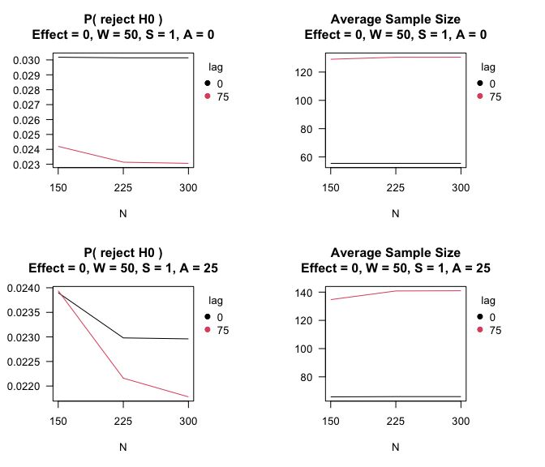
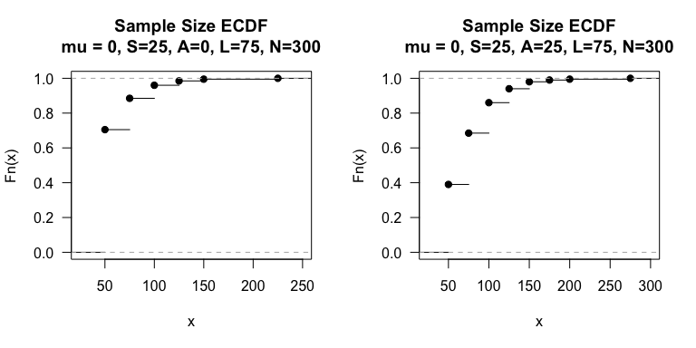
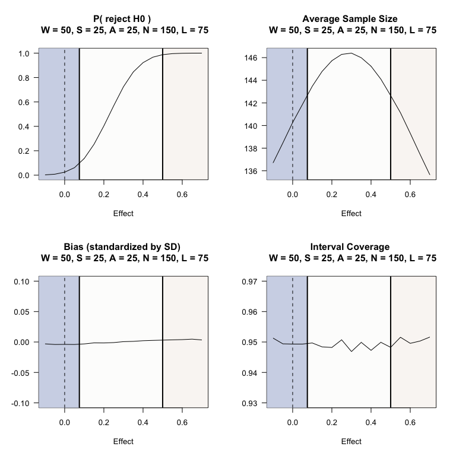
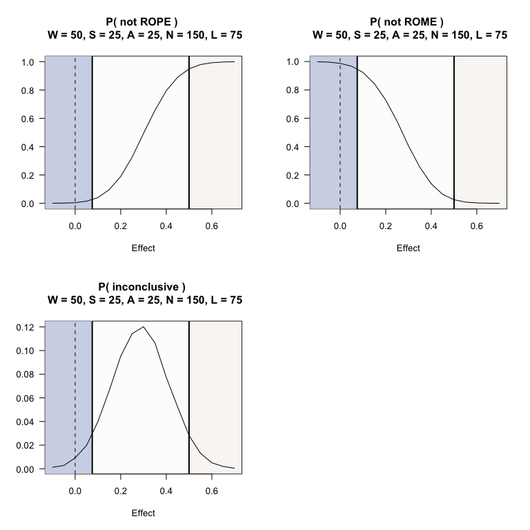

Two-arm randomized trial comparing differences in mean of normal outcome
================

``` r
Sys.info()[c("sysname","release","version","machine")]
```

                                                                                                     sysname 
                                                                                                    "Darwin" 
                                                                                                     release 
                                                                                                    "22.6.0" 
                                                                                                     version 
    "Darwin Kernel Version 22.6.0: Mon Feb 19 19:48:53 PST 2024; root:xnu-8796.141.3.704.6~1/RELEASE_X86_64" 
                                                                                                     machine 
                                                                                                    "x86_64" 

``` r
library(SeqSGPV)
nreps <- 50000
```

## Context

An implementation scientist wishes to test whether a phone app can help
adults 18+ in an urban city to reduce their sodium intake. At enrollment
a baseline measure of sodium intake will be assessed and then
participants will be randomized 1:1 to receive the phone app. The
estimand of interest is the mean difference in 3-month sodium intake,
$\Delta$, between the two arms for the city’s population. Assuming
loss-to-follow-up is not related to treatment assignment, the trial will
compare the observed 3-month sodium intake, adjusted for baseline,
between treatment arms.

In previous studies, the outcome has been observed to be heavily skewed,
similar to a `dgamma(shape=2,scale=sqrt(0.5))` distribution, and a
greater mean difference reflects greater fidelity in the intervention
arm. The outcome standard deviation is 1.

Without incorporating scientific relevance, a traditional hypothesis
could be:

H0: $\Delta$ $\le$ 0  
H1: $\Delta$ \> 0

However, practically equivalent effects to the null are up to 0.075. The
minimally scientifically meaningful effect is 0.5. The PRISM is defined
by ROE$`_{(0.075, 0.50)}`$.

The investigator wants a Type I error $\le$ 0.025 when $`\Delta = 0`$.

The investigators say the study can afford up to 300 participants,
though a maximum of 150 participants would be ideal. The investigators
would like to know the design-based average sample size, Type I error,
and Power across a range of treatment effects. The investigator prefers
to monitor for meaningful effects using a 95% confidence interval.

Logistically, the outcome takes 1 month to observe, and the planned
accrual is 25 participants a month. The team wishes to monitor outcomes
monthly. Hence, there could be 75 delayed outcomes at the point of
evaluation. If the accrual is slower, then the number of delayed
outcomes could be lower.

To inform the wait time, the investigator would want the expected width
of the confidence interval to be, approximately, no more than 1 .
Assuming normality, the calculate the desired wait time to be:

``` r
ciwidth <- 1
2 * ceiling((2 * 1.96 * sqrt(2) / ciwidth)^2)
```

    [1] 62

If they were to start after the second month of observed outcomes (i.e.,
50 outcomes), the expected CI width would be:

``` r
2 * 1.96 * sqrt(2 / (50/2))
```

    [1] 1.108743

The study team is satisfied with this to inform their wait time until
observing outcomes.

To benchmark a maximum sample size, they perform power calculations for
a single look study:

``` r
# Benchmark power for single-look design
power.t.test(power = 0.8, delta=.5, sig.level = 0.025, alternative = "one.sided")
```


         Two-sample t test power calculation 

                  n = 63.76576
              delta = 0.5
                 sd = 1
          sig.level = 0.025
              power = 0.8
        alternative = one.sided

    NOTE: n is number in *each* group

A SeqSGPV trial design to monitor PRISM is set with $W=25$,
$`S=\{1, 25\}`$, $`N=\{100, 150, 300, Inf\}`$, and $`A=\{0, 25\}`$.

``` r
# 2 sample trial with skewed outcomes and monitoring assuming normality (95% CIs)
# Hypotheses uninformed by scientific context
# H0: mu > 0
# H1: mu < 0
# PRISM: deltaG1 = 0.075, deltaG2 = 0.50
# Assess outcomes monthly -- 25 participants per month
# Possible delayed outcomes -- 0, 25, 50, 75
# Maximum sample size -- 100, 150, 300, Inf
system.time(PRISM <-  SeqSGPV(nreps            = nreps,
                              dataGeneration   = rgamma, dataGenArgs = list(n=300,shape=2,scale=.5),
                              effectGeneration = 0, effectGenArgs=NULL,  effectScale  = "identity",
                              allocation       = c(1,1),
                              effectPN         = 0,
                              null             = "less",
                              PRISM            = list(deltaL2 = NA,      deltaL1 = NA, 
                                                      deltaG1 = 0.075,   deltaG2 = 0.5),
                              modelFit         = lmCI,
                              modelFitArgs     = list(miLevel=.95),
                              wait             = 50,
                              steps            = c(1,25),
                              affirm           = c(0, 25),
                              lag              = c(0, 75),
                              N                = c(150, 225, 300),
                              printProgress    = FALSE))
```

       user  system elapsed 
    895.748  59.487 322.828 

``` r
# Note: This step is typically done after evaluating operating characteristics
# under the point null. It will be shown again later.
# This step is done here for the sake of saving an Rmd cache with
# minimal retained data (after removing the simulated date).

# Obtain design under range of effects
se <- round(seq(-0.1, 0.7, by = 0.05),2)
system.time(PRISMse <- fixedDesignEffects(PRISM, shift = se))
```

    [1] "effect: -0.1"
    [1] "effect: -0.05"
    [1] "effect: 0"
    [1] "effect: 0.05"
    [1] "effect: 0.1"
    [1] "effect: 0.15"
    [1] "effect: 0.2"
    [1] "effect: 0.25"
    [1] "effect: 0.3"
    [1] "effect: 0.35"
    [1] "effect: 0.4"
    [1] "effect: 0.45"
    [1] "effect: 0.5"
    [1] "effect: 0.55"
    [1] "effect: 0.6"
    [1] "effect: 0.65"
    [1] "effect: 0.7"

         user    system   elapsed 
    14374.661  1822.341  5385.047 

``` r
# This next step is not required but is done for reducing the size of the cache
#  saved when re-running rmd.
PRISM$mcmcMonitoring <- NULL
```

Assess the impact of delayed outcomes and additional control for using
an affirmation step.

``` r
par(mfrow=c(2,2))
# Impact of delayed outcomes
plot(PRISM,stat = "lag.rejH0", affirm=0,  steps=25)
plot(PRISM,stat = "lag.n",     affirm=0,  steps=25)
plot(PRISM,stat = "lag.rejH0", affirm=25, steps=25)
plot(PRISM,stat = "lag.n",     affirm=25, steps=25)
```


The affirmation step helps control the Type I error rate. In this
example, Type I error is controlled under 0.025 with $A=0$. However, in
this example, if $S=1$, there would be further need for the affirmation
step to control the Type I error rate.

``` r
par(mfrow=c(2,2))
# Impact of delayed outcomes
plot(PRISM,stat = "lag.rejH0", affirm=0,  steps=1)
plot(PRISM,stat = "lag.n",     affirm=0,  steps=1)
plot(PRISM,stat = "lag.rejH0", affirm=25, steps=1)
plot(PRISM,stat = "lag.n",     affirm=25, steps=1)
```



The affirmation step helps control the Type I error rate to be below
0.025.

Under, $\Delta=0$, we can see the empirical CDF of the sample size.
Below, is the ECDF for study with an unrestricted sample size.

``` r
par(mfrow=c(1,2))
plot(PRISM$mcmcECDFs$mcmcEndOfStudyEcdfN$W50_S25_A0_L75_N300,las=1, 
     main = "Sample Size ECDF\nmu = 0, S=25, A=0, L=75, N=300")
plot(PRISM$mcmcECDFs$mcmcEndOfStudyEcdfN$W50_S25_A25_L75_N300,las=1, 
     main = "Sample Size ECDF\nmu = 0, S=25, A=25, L=75, N=300")
```



Having established Type I error control, we can further evaluate
operating characteristics under a range of plausible outcomes. To be
conservative the affirmation step of $A=25$ will be used.

This next step was run previously but is shown here again as it is when
the step would more naturally take place.

``` r
# Obtain design under range of effects
se <- round(seq(-0.1, 0.7, by = 0.05),2)
system.time(PRISMse <- fixedDesignEffects(PRISM, shift = se))
```

``` r
par(mfrow=c(2,2))
plot(PRISMse, stat = "lag.rejH0", steps = 25, affirm = 25,  N = 150, lag = 75)
plot(PRISMse, stat = "lag.n",     steps = 25, affirm = 25,  N = 150, lag = 75)
plot(PRISMse, stat = "lag.bias",  steps = 25, affirm = 25,  N = 150, lag = 75, ylim=c(-.1,.1))
plot(PRISMse, stat = "lag.cover", steps = 25, affirm = 25,  N = 150, lag = 75, ylim=c(0.93, 0.97))
```



``` r
par(mfrow=c(2,2))
plot(PRISMse, stat = "lag.stopNotROPE",       steps = 25, affirm = 25,  N = 150, lag = 75)
plot(PRISMse, stat = "lag.stopNotROME",       steps = 25, affirm = 25,  N = 150, lag = 75)
plot(PRISMse, stat = "lag.stopInconclusive",  steps = 25, affirm = 25,  N = 150, lag = 75)
```



Effects in the ROE are the most likely to end inconclusively, and there
is low probability for effects in ROWPE and ROME to end inconclusively.
The investigator could use the SGPVs for ROWPE and ROME to suggest
whether to further investigate the intervention (see example
interpretation \#3).

The ECDF of sample size for a given treatment effect can be evaluated.

``` r
par(mfrow=c(2,2))
plot(PRISMse$`effect1_-0.1`$mcmcECDFs$mcmcEndOfStudyEcdfNLag$W50_S25_A0_L0_N300,las=1, 
     main = "Sample Size ECDF\nmu = -0.1")
plot(PRISMse$`effect1_0.1`$mcmcECDFs$mcmcEndOfStudyEcdfNLag$W50_S25_A0_L0_N300,las=1, 
     main = "Sample Size ECDF\nmu = 0.1")
plot(PRISMse$`effect1_0.3`$mcmcECDFs$mcmcEndOfStudyEcdfNLag$W50_S25_A0_L0_N300,las=1, 
     main = "Sample Size ECDF\nmu = 0.3")
plot(PRISMse$`effect1_0.5`$mcmcECDFs$mcmcEndOfStudyEcdfNLag$W50_S25_A0_L0_N300,las=1, 
     main = "Sample Size ECDF\nmu = 0.5")
```


## Example interpretations following SeqSGPV monitoring of PRISM:

1.  The estimated mean difference was 0.54 (95% confidence interval:
    0.09, 0.98) which is evidence that the treatment effect is at least
    practically better than the null hypothesis (p$`_{ROWPE}`$ = 0) and
    the evidence for being scientifically meaningful (p$`_{ROME}`$ =
    0.54).

2.  The estimated mean difference was -0.17 (95% confidence interval:
    -0.81, 0.48) which is evidence that the treatment effect is not
    scientifically meaningful (p$`_{ROME}`$ = 0) and the evidence for
    being practically equivalent or worse than the point null is
    p$`_{ROWPE}`$=0.69.

3.  The estimated mean difference was 0.31 (95% confidence interval:
    0.07, 0.56) at the maximum sample size, which is inconclusive
    evidence to rule out practically null effects (p$`_{ROWPE}`$ = 0.01)
    and scientifically meaningful effects (p$`_{ROME}`$=0.12). There is
    more evidence that the effect is practically null than
    scientifically meaningful.

For each conclusion, the following clarification may be provided: Based
on simulations with $W=50, S=25, A=25, N=150$ with a lag of observing 75
outcomes, the risk of bias is expected to be minimal and the 95%
confidence interval has near correct coverage. Please refer to the
figure of simulated design-based bias and coverage.
