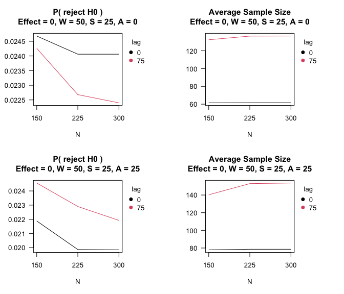

Two-arm randomized trial comparing differences in mean of normal outcome
================

## Two-arm randomized trial comparing differences in mean of normal outcome

An implementation scientist wishes to compare the impact of using a
fidelity feedback measure to roll out an intervention program. Over
time, the fidelity of the program decreases. The comparison of interest
is mean difference in 12m fidelity between arms. The outcome is assumed
to be normally distributed and a greater mean difference reflects
greater fidelity in the intervention arm.

Participants will be randomized 1:1 to either the standard of care or to
receive the fidelity feedback tool.

H0: mean difference $\le$ 0  
H1: mean difference \> 0

The investigators says study can afford up to 300 participants, though a
maximum of 150 participants would be ideal, and would like to know the
design-based average sample size, Type I error, and Power across a range
of treatment effects. The investigator prefers to monitor for meaningful
effects using a 95% confidence interval.

In this study, effects deemed essentially equivalent or worse than the
null hypothesis (i.e. ROWPE) are mean differences of -0.075 and greater.
The minimal scientifically meaningful effect (i.e. ROME) is an effect
size of at least -0.5.

The investigator wants a Type I error $\le$ 0.05.

``` r
# Benchmark power for single-look design
power.t.test(150/2, delta=.5, sig.level = 0.05, alternative = "one.sided")
```


         Two-sample t test power calculation 

                  n = 75
              delta = 0.5
                 sd = 1
          sig.level = 0.05
              power = 0.9196865
        alternative = one.sided

    NOTE: n is number in *each* group

``` r
power.t.test(300/2, delta=.5, sig.level = 0.05, alternative = "one.sided")
```


         Two-sample t test power calculation 

                  n = 150
              delta = 0.5
                 sd = 1
          sig.level = 0.05
              power = 0.9962682
        alternative = one.sided

    NOTE: n is number in *each* group

``` r
# Example 2
# 2 sample trial with normally distributed outcomes
# H0: mu > 0
# H1: mu < 0
# PRISM: deltaL2 = -0.5, deltaL1 = -0.075
# Assess outcomes monthly -- 25 participants per month
# Possible delayed outcomes -- 0, 25, 50, 75
# Maximum sample size -- 150, 300, Inf

nreps <- 20
system.time(PRISM2 <-  SeqSGPV(nreps            = nreps,
                               dataGeneration   = rnorm, dataGenArgs = list(n=300,sd=1),
                               effectGeneration = 0, effectGenArgs=NULL,  effectScale  = "identity",
                               allocation       = c(1,1),
                               effectPN         = 0,
                               null             = "less",
                               PRISM            = list(deltaL2 = NA,      deltaL1 = NA, 
                                                       deltaG1 = 0.075,   deltaG2 = 0.5),
                               modelFit         = lmCI,
                               modelFitArgs     = list(miLevel=.95),
                               wait             = 25,
                               steps            = c(1,25),
                               affirm           = c(0, 25),
                               lag              = c(0, 25, 50, 75),
                               N                = c(150, 300, Inf),
                               printProgress    = FALSE))
```

       user  system elapsed 
      0.303   0.209   0.270 

Assess the impact of delayed outcomes.

``` r
par(mfrow=c(1,2))
# Impact of delayed outcomes
plot(PRISM2,stat = "lag.rejH0", affirm=0, steps=25)
plot(PRISM2,stat = "lag.n",     affirm=0, steps=25)
```


``` r
par(mfrow=c(1,2))
plot(PRISM2$mcmcECDFs$mcmcEndOfStudyEcdfN$W25_S25_A0_L75_NInf,las=1, 
     main = "Sample Size ECDF\nmu = 0, S=25, A=0, L=75, N=Inf")
plot(PRISM2$mcmcECDFs$mcmcEndOfStudyEcdfN$W25_S25_A25_L75_NInf,las=1, 
     main = "Sample Size ECDF\nmu = 0, S=25, A=25, L=75, N=Inf")
```


Evaluate operating characteristics under a range of plausible outcomes.

``` r
# Obtain design under range of effects
se <- round(seq(-0.1, 0.7, by = 0.05),2)
system.time(PRISMse2 <- fixedDesignEffects(PRISM2, shift = se))
```

    [1] "effect: -0.1"
    [1] "effect: -0.05"
    [1] "effect: 0"
    [1] "effect: 0.05"
    [1] "effect: 0.1"
    [1] "effect: 0.15"
    [1] "effect: 0.2"
    [1] "effect: 0.25"
    [1] "effect: 0.3"
    [1] "effect: 0.35"
    [1] "effect: 0.4"
    [1] "effect: 0.45"
    [1] "effect: 0.5"
    [1] "effect: 0.55"
    [1] "effect: 0.6"
    [1] "effect: 0.65"
    [1] "effect: 0.7"

       user  system elapsed 
      4.503   5.636   3.886 

``` r
par(mfrow=c(2,2))
plot(PRISMse2, stat = "lag.rejH0", steps = 25, affirm = 0,  N = 300, lag = 75)
plot(PRISMse2, stat = "lag.n",     steps = 25, affirm = 0,  N = 300, lag = 75)
plot(PRISMse2, stat = "lag.bias",  steps = 25, affirm = 0,  N = 300, lag = 75)
plot(PRISMse2, stat = "lag.cover", steps = 25, affirm = 0,  N = 300, lag = 75, ylim=c(0.93, 0.97))
```



ECDF of sample size for a treatment effect in the Grey Zone.

``` r
plot(PRISMse2$`effect1_0.3`$mcmcECDFs$mcmcEndOfStudyEcdfNLag$W25_S25_A0_L0_N300,las=1, 
     main = "Sample Size ECDF\nmu = 0.3")
```


## Example interpretations following SeqSGPV monitoring of PRISM:

1.  The estimated treatment effect was 1.05 (95% confidence interval:
    0.24, 1.85) which is evidence that the treatment effect is at least
    trivially better than the null hypothesis (p$_{ROWPE}$ = 0) and is
    evidence to reject the null hypothesis (p$_{NULL}$ = 0).

2.  The estimated treatment effect was -0.61 (95% confidence interval:
    -1.45, 0.24) which is evidence that the treatment effect is not
    scientifically meaningful (p$_{ROME}$ = 0). The evidence toward the
    null hypothesis is $p_{NULL} = 0.86$.

3.  The estimated treatment effect was 0.26 (95% confidence interval:
    0.005, 0.514), which is suggestive though inconclusive evidence to
    rule out at essentially null effects (p$_{ROWPE}$ = 0.14) yet is
    evidence to reject the null hypothesis (p$_{NULL}$ = 0).

4.  The estimated treatment effect was 0.30 (95% confidence interval:
    -0.10, 0.69) which is insufficient evidence to rule out any of
    essentially null effects (p$_{ROWPE}$ = 0.22), scientifically
    meaningful effects (p$_{ROME}$ = 0.25), nor the null hypothesis
    effects (p$_{NULL}$ = 0.13).

For each conclusion, the following clarification may be provided: Based
on simulations, there may be an absolute bias, in terms of effect size,
as large 0.02 and interval coverage as low as 0.93. The bias is towards
the null for effects less than 0.31 and away from the null for effects
greater than 0.31 (see figure of simulated design-based bias and
coverage).
